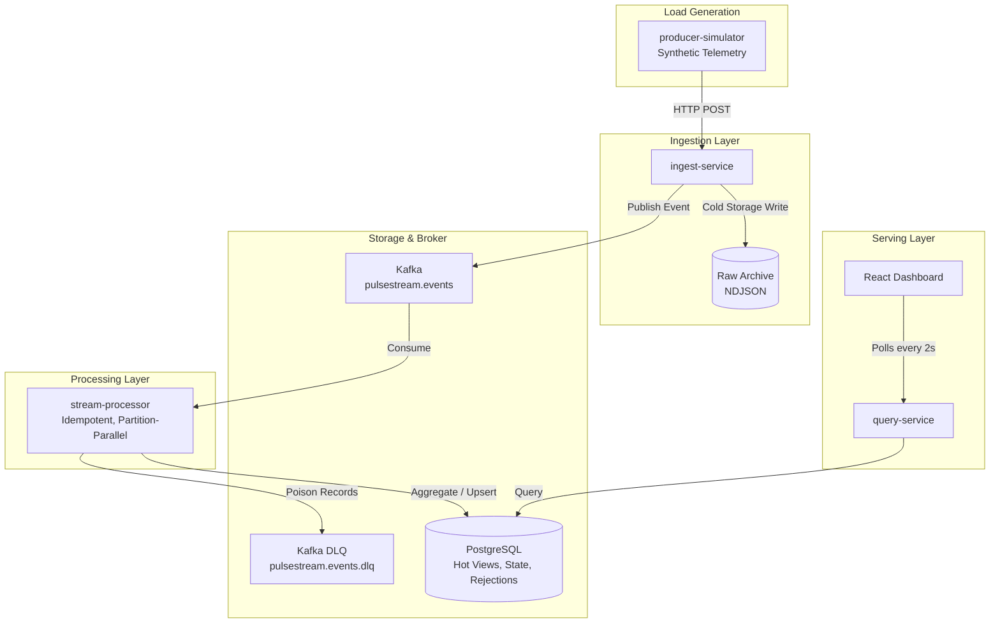

# PulseStream

PulseStream is a real-time event analytics platform built to demonstrate streaming-system fundamentals instead of CRUD breadth. The MVP ingests synthetic telemetry events through a Go HTTP service, publishes them to Kafka, processes them in near real time, stores hot views in PostgreSQL, and exposes a live React dashboard plus Prometheus-ready operational metrics.

## MVP scope

- Go services for ingest, stream processing, query, and synthetic load generation
- Kafka-backed event pipeline with idempotent-at-least-once processing and poison-message dead-lettering
- PostgreSQL hot views for tenant and source aggregates
- Immutable raw-event archive plus admin replay for recovery and backfills
- React + Vite live dashboard polling the query service every 2 seconds
- Prometheus scraping, Grafana provisioning, and JSON structured service logs
- Docker Compose topology and GitHub Actions CI

## Repository layout

```text
services/
  producer-simulator/
  ingest-service/
  stream-processor/
  query-service/
internal/
  api/
  events/
  platform/
  processor/
  simulator/
  store/
  telemetry/
web/dashboard/
schemas/
deploy/docker-compose/
deploy/azure/container-apps/
docs/
scripts/
asyncapi.yaml
```

## Quick start

1. Build and start the local stack:

   ```powershell
   docker compose -f deploy/docker-compose/docker-compose.yml up --build
   ```

2. Open the live surfaces:

    - Dashboard: `http://localhost:4173`
    - Query API: `http://localhost:8081/api/v1/metrics/overview` with `Authorization: Bearer <jwt>`
    - Ingest API: `http://localhost:8080/api/v1/events`
    - Prometheus: `http://localhost:9090`
    - Grafana: `http://localhost:3000` with `admin` / `admin`

3. Run the benchmark driver:

   ```powershell
   ./scripts/load-test/benchmark.ps1 -Rate 1500 -DurationSeconds 60 -ProcessorReplicas 3
   ```

    The benchmark driver defaults to a one-off Compose-network producer so the published artifacts are not distorted by Windows host networking. It can also scale the processor service before a run and records the observed replica count in the artifact.

4. Run the poison-message drill:

   ```powershell
   ./scripts/chaos/inject-poison-message.ps1
   ```

   The drill pauses the compose simulator, launches a temporary processor with a fresh consumer group at the current topic tail, writes one malformed record directly to Kafka, and captures the resulting `dead_letter_total` delta as a JSON artifact.

5. Validate the asynchronous contract:

   ```powershell
   npm install
   npm run contract:validate
   ```

   The contract is defined in [asyncapi.yaml](/C:/Projects/real-time-event-processing-fabric/asyncapi.yaml) and reuses the JSON Schemas under [schemas/](/C:/Projects/real-time-event-processing-fabric/schemas).

## Local auth

JWT auth and tenant-scoped authorization are enabled in the local stack. The dashboard and simulator images are built with a development admin token so the default operator path works after `docker compose up`.

For manual API access, mint a token with the local development secret:

```powershell
go run ./cmd/dev-token `
  -role admin `
  -subject local-admin `
  -secret pulsestream-dev-secret
```

## Current architecture



## Contract governance

- [asyncapi.yaml](/C:/Projects/real-time-event-processing-fabric/asyncapi.yaml) documents the Kafka topics, operations, headers, and examples for `pulsestream.events` and `pulsestream.events.dlq`
- [telemetry-event-v1.schema.json](/C:/Projects/real-time-event-processing-fabric/schemas/telemetry-event-v1.schema.json) is the source payload schema for accepted telemetry events
- [dead-letter-record-v1.schema.json](/C:/Projects/real-time-event-processing-fabric/schemas/dead-letter-record-v1.schema.json) defines the processor-side poison-message payload
- GitHub Actions validates the AsyncAPI document on every push and pull request

## Azure variant

- The Kafka client layer now supports local `PLAINTEXT` Kafka and Azure Event Hubs via `SASL_SSL` plus `PLAIN` credentials from environment variables
- Azure Container Apps deployment scaffolding for the backend services lives under [deploy/azure/container-apps](/C:/Projects/real-time-event-processing-fabric/deploy/azure/container-apps)
- The ingest service now supports a Blob-backed raw archive for durable Azure replay, using managed identity by default
- The deployment template assumes existing Event Hubs, Blob Storage, and PostgreSQL dependencies and focuses on application hosting first

## Evidence goals

- Throughput target: `5k events/sec` sustained for the MVP benchmark gate
- Dashboard freshness target: under `2s`
- Failure proofs: processor restart, duplicate handling, malformed burst handling, broker outage handling, PostgreSQL slowdown drill, archive replay and hot-view rebuild
- Docs and runbooks: see the files under [`docs/`](docs)

## Status

The codebase implements the MVP pipeline, local platform wiring, JWT auth, tenant-scoped authorization, PostgreSQL row-level security, poison-message dead-lettering, Kafka trace propagation, contract validation, an Event Hubs-compatible Kafka transport layer, a Blob-backed Azure hosting path, processor-side Kafka retry handling, and an explicit ingest in-flight backpressure gate. Redis caching, Azure dashboard deployment, and Azure benchmark evidence remain follow-on work.

Current benchmark evidence shows the ingest path sustaining roughly `1.2k accepted eps` and the optimized processor sustaining roughly `876 processed eps` under the documented Compose benchmark profile. The repo now also has scale-aware evidence for processor replicas: under the current exact-count harness, a `3`-replica processor run processed `595.02 eps` versus `568.43 eps` for `1` replica, with better `p95`/`p99` latency and slightly lower peak lag. The next engineering gap is raising producer-side offered load so processor scaling can be measured under a harder sustained profile.
 
Poison-message handling is now verified in the scripted drill artifact `artifacts/failure-drills/inject-poison-message-20260411-152328.json`: a malformed record written directly to `pulsestream.events` was consumed by a fresh-group processor, published to `pulsestream.events.dlq`, and surfaced through `dead_letter_total` in the overview API.

Broker-outage handling is now verified in `artifacts/failure-drills/broker-outage-20260416-201249.json`: with an `800 eps` target load and a `12s` Kafka outage, the processor stayed alive, Kafka health was detected during the run, accepted traffic recovered within the observation window, and raw-archive accounting closed with a `0` event gap. The run recorded `2,980` explicit `publish_failed` rejections and `19,100` explicit `backpressure` rejections. The remaining gap is that the producer log still contained `278` client-side timeouts, so ingest overload behavior is improved but not fully clean yet.

PostgreSQL pause handling is now verified in `artifacts/failure-drills/pause-postgres-20260416-202040.json`: with an `800 eps` target load and a `12s` Postgres pause, ingest accepted and archived `26,195` events, query overview calls failed visibly while the dependency was paused, processor in-flight peaked at `485`, and processing resumed `1.24s` after Postgres reported healthy. The remaining gap is elevated final consumer lag and a small number of producer-side timeouts during the DB stall.

Archive replay and hot-view rebuild are now verified in `artifacts/failure-drills/replay-archive-20260416173251.json`: the drill created a sentinel tenant with `25` accepted events, replayed the archived events once, observed `25` duplicate discards with `0` source-metric overcount, reset only the sentinel tenant's hot-view and dedup rows, replayed again, and rebuilt the processed-event and source-metric counts back to `25`. The remaining gap is replay efficiency: the current date-partitioned flat-file archive scanned `498,706` records to replay `25`, so production-scale replay needs tenant/time indexing or object-prefix partitioning.

## Admin replay

The ingest service exposes a local admin replay endpoint guarded by `X-Admin-Token` or `Authorization: Bearer <token>`.

```powershell
Invoke-RestMethod `
  -Method Post `
  -Uri http://localhost:8080/api/v1/admin/replay `
  -Headers @{ "X-Admin-Token" = "pulsestream-dev-admin" } `
  -ContentType "application/json" `
  -Body '{"start_date":"2026-04-10","tenant_id":"tenant_01","limit":500}'
```

For a repeatable proof that replay is duplicate-safe and can rebuild hot views for a scoped tenant, run:

```powershell
./scripts/chaos/replay-archive.ps1 -EventCount 25 -WaitTimeoutSeconds 90
```
