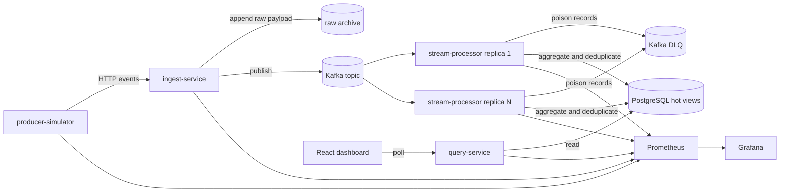

# PulseStream

PulseStream is a real-time event analytics platform for synthetic telemetry. It ingests events through a Go HTTP service, publishes them to Kafka, processes them in near real time, stores hot operational views in PostgreSQL, archives raw payloads for replay, and exposes a React dashboard plus operator APIs.

## What the project demonstrates

- Event-driven architecture with a broker-backed write path
- Idempotent at-least-once processing with duplicate suppression
- Separation of hot operational state and cold raw event storage
- JWT authentication, tenant-scoped authorization, and PostgreSQL row-level security
- Failure handling with restart, poison-message, broker-outage, Postgres-pause, and replay drills
- Processor replica scaling with measured throughput and lag
- Operational telemetry through Prometheus, Grafana, structured logs, and OpenTelemetry hooks
- AsyncAPI and JSON Schema contract governance
- Azure-aligned runtime path through Event Hubs-compatible Kafka settings, Blob-backed archive support, and Container Apps deployment scaffolding

## Architecture



## Services

| Component | Responsibility |
| --- | --- |
| `producer-simulator` | Generates synthetic telemetry, duplicates, malformed payloads, and burst traffic |
| `ingest-service` | Authenticates producers, validates events, records rejections, writes raw archive entries, and publishes to Kafka |
| `stream-processor` | Consumes Kafka partitions, deduplicates by `event_id`, dead-letters poison records, computes aggregates, and writes hot views |
| `query-service` | Serves overview, tenant-series, top-source, rejection, and tenant-scoped dashboard APIs |
| `dashboard` | Renders live operator views from the query API |
| `Prometheus` and `Grafana` | Scrape and display platform metrics |

## Current evidence

| Scenario | Artifact | Summary |
| --- | --- | --- |
| Single processor benchmark | `artifacts/benchmarks/benchmark-20260410-212955.json` | `713.09 accepted eps`, `568.43 processed eps`, `p95 14 ms`, `lag peak 1308` |
| Three processor benchmark | `artifacts/benchmarks/benchmark-20260410-213110.json` | `700.37 accepted eps`, `595.02 processed eps`, `p95 11 ms`, `lag peak 1246` |
| Three replica restart drill | `artifacts/failure-drills/restart-processor-20260410-212812.json` | one processor replica restarted during load, `0` rejections, `p95 11 ms`, `lag peak 828` |
| Poison-message drill | `artifacts/failure-drills/inject-poison-message-20260411-152328.json` | malformed Kafka record moved to DLQ and surfaced through `dead_letter_total` |
| Broker outage drill | `artifacts/failure-drills/broker-outage-20260416-201249.json` | `12s` Kafka outage, `0` archive accounting gap, explicit `publish_failed` and `backpressure` rejections |
| PostgreSQL pause drill | `artifacts/failure-drills/pause-postgres-20260416-202040.json` | `12s` Postgres pause, visible query degradation, processing resumed `1.24s` after Postgres became healthy |
| Replay and rebuild drill | `artifacts/failure-drills/replay-archive-20260416173251.json` | `25` replayed duplicates produced `0` overcount; scoped reset rebuilt hot views back to `25` |

Current local evidence shows that replica scaling improves processor-side throughput and tail latency, but the producer path is limiting higher-rate local measurements. The next measurement gap is a higher-capacity producer profile or a cloud deployment variant that can stress the consumer group more aggressively.

## Quick start

1. Start the local stack.

   ```powershell
   docker compose -f deploy/docker-compose/docker-compose.yml up --build
   ```

2. Open the local surfaces.

   - Dashboard: `http://localhost:4173`
   - Query API: `http://localhost:8081/api/v1/metrics/overview` with `Authorization: Bearer <jwt>`
   - Ingest API: `http://localhost:8080/api/v1/events`
   - Prometheus: `http://localhost:9090`
   - Grafana: `http://localhost:3000` with `admin` / `admin`

3. Run a benchmark.

   ```powershell
   ./scripts/load-test/benchmark.ps1 -Rate 1500 -DurationSeconds 30 -WarmupSeconds 5 -ProcessorReplicas 3
   ```

4. Run a restart drill.

   ```powershell
   ./scripts/chaos/restart-processor.ps1 -Rate 1000 -DurationSeconds 30 -WarmupSeconds 5 -ProcessorReplicas 3
   ```

5. Run the replay and rebuild drill.

   ```powershell
   ./scripts/chaos/replay-archive.ps1 -EventCount 25 -WaitTimeoutSeconds 90
   ```

6. Validate the asynchronous contract.

   ```powershell
   npm install
   npm run contract:validate
   ```

## Local auth

JWT auth and tenant-scoped authorization are enabled in the local stack. The dashboard and simulator images are built with a development admin token so the default operator path works after `docker compose up`.

For manual API access, mint a token with the local development secret:

```powershell
go run ./cmd/dev-token `
  -role admin `
  -subject local-admin `
  -secret pulsestream-dev-secret
```

Admin tokens can query any tenant and call replay endpoints. `tenant_user` tokens are restricted to their assigned `tenant_id`. Health, readiness, and Prometheus metrics endpoints remain unauthenticated.

## Repository layout

```text
services/
  producer-simulator/
  ingest-service/
  stream-processor/
  query-service/
internal/
  api/
  archive/
  events/
  platform/
  processor/
  simulator/
  store/
  telemetry/
web/dashboard/
deploy/docker-compose/
deploy/azure/container-apps/
docs/
scripts/
schemas/
asyncapi.yaml
```

## Documentation

- [Architecture](docs/architecture.md)
- [API specification](docs/api-spec.md)
- [Data model](docs/data-model.md)
- [Benchmarking](docs/benchmarking.md)
- [Failure modes](docs/failure-modes.md)
- [Runbook](docs/runbook.md)

## Contract governance

- [asyncapi.yaml](asyncapi.yaml) documents the Kafka topics, operations, headers, and examples for `pulsestream.events` and `pulsestream.events.dlq`
- [telemetry-event-v1.schema.json](schemas/telemetry-event-v1.schema.json) is the source payload schema for accepted telemetry events
- [dead-letter-record-v1.schema.json](schemas/dead-letter-record-v1.schema.json) defines the processor-side poison-message payload
- GitHub Actions validates the AsyncAPI document on every push and pull request

## Azure variant

- The Kafka client layer supports local `PLAINTEXT` Kafka and Azure Event Hubs via `SASL_SSL` plus `PLAIN` credentials from environment variables
- Azure Container Apps deployment scaffolding for the backend services lives under [deploy/azure/container-apps](deploy/azure/container-apps)
- The ingest service supports a Blob-backed raw archive for durable Azure replay, using managed identity by default
- The deployment template assumes existing Event Hubs, Blob Storage, and PostgreSQL dependencies and focuses on application hosting first

## Current limits

- Redis caching is not part of the current hot path; PostgreSQL remains the only operational read store.
- Azure dashboard deployment and published Azure benchmark evidence are still follow-on work.
- The benchmark harness is credible for local evidence, but local producer throughput is currently the next limiting factor.
- The local date-partitioned archive scanned `498,706` records to replay `25` in the latest drill, so production-scale replay needs tenant/time indexing or object-prefix partitioning.
