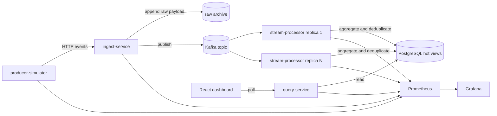

# PulseStream

PulseStream is a real-time event analytics platform for synthetic telemetry. It ingests events through a Go HTTP service, publishes them to Kafka, processes them in near real time, stores hot operational views in PostgreSQL, archives raw payloads for replay, and exposes a React dashboard plus operator APIs.

## What the project demonstrates

- Event-driven architecture with a broker-backed write path
- Idempotent at-least-once processing with duplicate suppression
- Separation of hot operational state and cold raw event storage
- Failure handling with replay and restart drills
- Processor replica scaling with measured throughput and lag
- Operational telemetry through Prometheus, Grafana, structured logs, and OpenTelemetry hooks

## Architecture



## Services

| Component | Responsibility |
| --- | --- |
| `producer-simulator` | Generates synthetic telemetry, duplicates, malformed payloads, and burst traffic |
| `ingest-service` | Validates events, records rejections, writes raw archive entries, and publishes to Kafka |
| `stream-processor` | Consumes Kafka partitions, deduplicates by `event_id`, computes aggregates, and writes hot views |
| `query-service` | Serves overview, tenant-series, top-source, and rejection APIs |
| `dashboard` | Renders live operator views from the query API |
| `Prometheus` and `Grafana` | Scrape and display platform metrics |

## Current evidence

| Scenario | Artifact | Summary |
| --- | --- | --- |
| Single processor benchmark | `artifacts/benchmarks/benchmark-20260410-212955.json` | `713.09 accepted eps`, `568.43 processed eps`, `p95 14 ms`, `lag peak 1308` |
| Three processor benchmark | `artifacts/benchmarks/benchmark-20260410-213110.json` | `700.37 accepted eps`, `595.02 processed eps`, `p95 11 ms`, `lag peak 1246` |
| Three replica restart drill | `artifacts/failure-drills/restart-processor-20260410-212812.json` | one processor replica restarted during load, `0` rejections, `p95 11 ms`, `lag peak 828` |

Current local evidence shows that replica scaling improves processor-side throughput and tail latency, but the producer path is now limiting higher-rate local measurements. The next measurement gap is a higher-capacity producer profile or a cloud deployment variant that can stress the consumer group more aggressively.

## Quick start

1. Start the local stack.

   ```powershell
   docker compose -f deploy/docker-compose/docker-compose.yml up --build
   ```

2. Open the local surfaces.

   - Dashboard: `http://localhost:4173`
   - Query API: `http://localhost:8081/api/v1/metrics/overview`
   - Ingest API: `http://localhost:8080/api/v1/events`
   - Prometheus: `http://localhost:9090`
   - Grafana: `http://localhost:3000`

3. Run a benchmark.

   ```powershell
   ./scripts/load-test/benchmark.ps1 -Rate 1500 -DurationSeconds 30 -WarmupSeconds 5 -ProcessorReplicas 3
   ```

4. Run a restart drill.

   ```powershell
   ./scripts/chaos/restart-processor.ps1 -Rate 1000 -DurationSeconds 30 -WarmupSeconds 5 -ProcessorReplicas 3
   ```

## Repository layout

```text
services/
  producer-simulator/
  ingest-service/
  stream-processor/
  query-service/
internal/
  api/
  archive/
  events/
  platform/
  processor/
  simulator/
  store/
  telemetry/
web/dashboard/
deploy/docker-compose/
docs/
scripts/
schemas/
```

## Documentation

- [Architecture](docs/architecture.md)
- [API specification](docs/api-spec.md)
- [Data model](docs/data-model.md)
- [Benchmarking](docs/benchmarking.md)
- [Failure modes](docs/failure-modes.md)
- [Runbook](docs/runbook.md)

## Current limits

- The local environment does not yet include tenant authentication or tenant-scoped authorization.
- The hot path currently uses PostgreSQL only; Redis and cloud-native caches are not part of the current build.
- The cloud deployment path and Event Hubs variant are not implemented yet.
- The benchmark harness is credible for local evidence, but local producer throughput is currently the next limiting factor.
