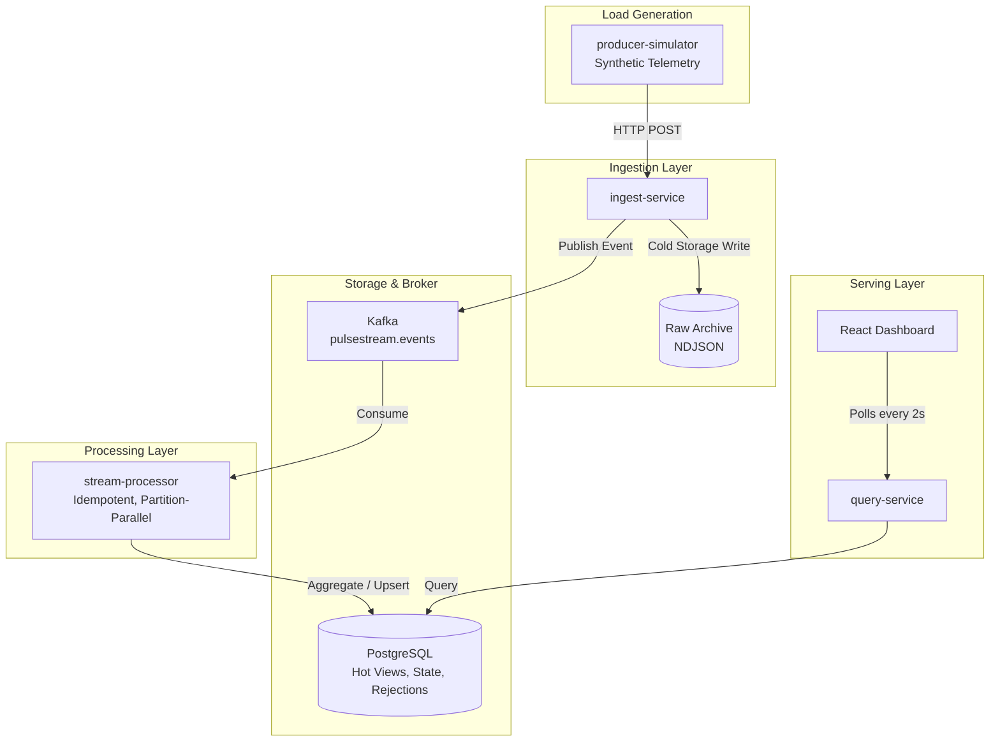

# PulseStream

PulseStream is a real-time event analytics platform built to demonstrate streaming-system fundamentals instead of CRUD breadth. The MVP ingests synthetic telemetry events through a Go HTTP service, publishes them to Kafka, processes them in near real time, stores hot views in PostgreSQL, and exposes a live React dashboard plus Prometheus-ready operational metrics.

## MVP scope

- Go services for ingest, stream processing, query, and synthetic load generation
- Kafka-backed event pipeline with idempotent-at-least-once processing
- PostgreSQL hot views for tenant and source aggregates
- Immutable raw-event archive plus admin replay for recovery and backfills
- React + Vite live dashboard polling the query service every 2 seconds
- Prometheus scraping, Grafana provisioning, and JSON structured service logs
- Docker Compose topology and GitHub Actions CI

## Repository layout

```text
services/
  producer-simulator/
  ingest-service/
  stream-processor/
  query-service/
internal/
  api/
  events/
  platform/
  processor/
  simulator/
  store/
  telemetry/
web/dashboard/
schemas/
deploy/docker-compose/
docs/
scripts/
```

## Quick start

1. Build and start the local stack:

   ```powershell
   docker compose -f deploy/docker-compose/docker-compose.yml up --build
   ```

2. Open the live surfaces:

   - Dashboard: `http://localhost:4173`
   - Query API: `http://localhost:8081/api/v1/metrics/overview`
   - Ingest API: `http://localhost:8080/api/v1/events`
   - Prometheus: `http://localhost:9090`
   - Grafana: `http://localhost:3000` with `admin` / `admin`

3. Run the benchmark driver:

   ```powershell
   ./scripts/load-test/benchmark.ps1 -Rate 1500 -DurationSeconds 60 -ProcessorReplicas 3
   ```

   The benchmark driver defaults to a one-off Compose-network producer so the published artifacts are not distorted by Windows host networking. It can also scale the processor service before a run and records the observed replica count in the artifact.

## Current architecture



## Evidence goals

- Throughput target: `5k events/sec` sustained for the MVP benchmark gate
- Dashboard freshness target: under `2s`
- Failure proofs: processor restart, duplicate handling, malformed burst handling, PostgreSQL slowdown drill
- Docs and runbooks: see the files under [`docs/`](docs)

## Status

The codebase implements the MVP pipeline and local platform wiring. Tenant auth, replay jobs, Redis caching, and cloud deployment remain explicitly out of MVP and are called out as follow-on work in the docs.

Current benchmark evidence shows the ingest path sustaining roughly `1.2k accepted eps` and the optimized processor sustaining roughly `876 processed eps` under the documented Compose benchmark profile. The repo now also has scale-aware evidence for processor replicas: under the current exact-count harness, a `3`-replica processor run processed `595.02 eps` versus `568.43 eps` for `1` replica, with better `p95`/`p99` latency and slightly lower peak lag. The next engineering gap is raising producer-side offered load so processor scaling can be measured under a harder sustained profile.

## Admin replay

The ingest service exposes a local admin replay endpoint guarded by `X-Admin-Token` or `Authorization: Bearer <token>`.

```powershell
Invoke-RestMethod `
  -Method Post `
  -Uri http://localhost:8080/api/v1/admin/replay `
  -Headers @{ "X-Admin-Token" = "pulsestream-dev-admin" } `
  -ContentType "application/json" `
  -Body '{"start_date":"2026-04-10","tenant_id":"tenant_01","limit":500}'
```
