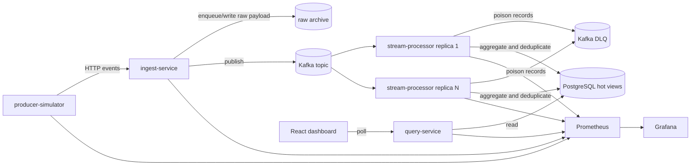

# PulseStream

PulseStream is a KernelGuard real-time telemetry analytics product. It ingests high-volume security and operational events through Go HTTP APIs, publishes them to Kafka, processes them in near real time, stores hot operational views in PostgreSQL, archives raw payloads for replay, and exposes a React dashboard plus operator APIs.

## What the project demonstrates

- Event-driven architecture with a broker-backed write path and batch ingest API
- Idempotent at-least-once processing with duplicate suppression
- Bounded processor batching, event-time windows, late-event counters, and partition/task visibility
- Separation of hot operational state and cold raw event storage
- JWT authentication, tenant-scoped authorization, and PostgreSQL row-level security
- Failure handling with restart, poison-message, broker-outage, Postgres-pause, and replay drills
- Processor replica scaling with measured throughput and lag
- Operational telemetry through Prometheus, Grafana, structured logs, and OpenTelemetry hooks
- AsyncAPI and JSON Schema contract governance
- Azure-aligned runtime path through Event Hubs-compatible Kafka settings, Blob-backed archive support, and Container Apps deployment scaffolding

## Architecture



## Services

| Component | Responsibility |
| --- | --- |
| `producer-simulator` | Generates synthetic telemetry, duplicates, malformed payloads, burst traffic, and HTTP batch load |
| `ingest-service` | Authenticates producers, validates single-event or batch requests, records rejections, writes raw archive entries, and publishes to Kafka |
| `stream-processor` | Consumes Kafka partitions, batches per-partition writes, deduplicates by `event_id`, classifies late events, dead-letters poison records, computes hot and event-time aggregates, and writes service snapshots |
| `query-service` | Serves overview, tenant-series, event-window, partition-health, top-source, rejection, and tenant-scoped dashboard APIs |
| `dashboard` | Renders live operator views, event-time windows, partition health, replay controls, and evidence gates |
| `Prometheus` and `Grafana` | Scrape and display platform metrics |

## Current evidence

| Scenario | Artifact | Summary |
| --- | --- | --- |
| Latest batch 5k benchmark | `artifacts/benchmarks/benchmark-20260423-132558.json` | `4` producers, `3` processors, batch size `25`, target `5,000 eps`; observed `4,980.08 accepted eps`, `4,962.23 processed eps`, query `p95 52.19 ms`, drain `3.59s`; MVP throughput gate narrowly not met |
| Latest batch 2k performance gate | `artifacts/benchmarks/benchmark-performance-gate-20260423-131819.json` | `4` producers, `3` processors, batch size `25`, target `2,000 eps`; observed `1,973.53 accepted eps`, `2,030.64 processed eps`, query `p95 26.24 ms`, drain `0.01s`; intermediate throughput gate met |
| Pre-batch 2k performance gate | `artifacts/benchmarks/benchmark-performance-gate-20260423-124945.json` | `4` producers, `3` processors, one-event HTTP path; observed `898.67 accepted eps`, `910.44 processed eps`, query `p95 135.03 ms`, drain `2.02s`; throughput target not met |
| Best 2k gate after hot-path fixes | `artifacts/benchmarks/benchmark-performance-gate-20260423-123425.json` | async archive and set-based aggregate writes; observed `1,308.55 accepted eps`, `1,166.05 processed eps`, query `p95 63.97 ms`, drain `0.01s`; throughput target not met |
| Pre-fix 2k performance gate | `artifacts/benchmarks/benchmark-performance-gate-20260420-160655.json` | target `2,000 eps`; observed `717.1 accepted eps`, `495.08 processed eps`, query `p95 265.82 ms`, drain `39.53s`; target not met |
| Pre-batch 5k offered-load benchmark | `artifacts/benchmarks/benchmark-20260417-222710.json` | `4` producers, `3` processors, one-event HTTP path; observed `955.91 accepted eps`, `329.37 processed eps`, query `p95 147.13 ms`, peak lag `10,969`; target not met |
| Processor restart drill | `artifacts/failure-drills/restart-processor-20260417-225121.json` | `3` processors, `300 eps`; one replica restarted, lag recovered in `6.29s`, final lag `0` |
| Broker outage drill | `artifacts/failure-drills/broker-outage-20260417-224838.json` | `10s` Kafka outage, archive accounting gap `0`, accepted traffic recovered in `2.09s`, `4,008` explicit publish failures |
| PostgreSQL pause drill | `artifacts/failure-drills/pause-postgres-20260417-224710.json` | `10s` Postgres pause, `3` overview API failures, processor progress resumed `0.02s` after Postgres became healthy |
| Replay and rebuild drill | `artifacts/failure-drills/replay-archive-20260417193652.json` | `25` duplicate replays produced `0` source-metric overcount; scoped hot-view reset rebuilt processed/source counts back to `25` |
| Poison-message drill | `artifacts/failure-drills/inject-poison-message-20260417-193308.json` | malformed Kafka record produced `dead_letter_delta: 1` without blocking the processor loop |

Current local evidence is deliberately conservative. Batch ingest met the intermediate `2,000 processed eps` gate and brought the `5,000 processed eps` profile to a near miss at `4,962.23 processed eps`. The 2026-04-23 fixes removed the raw archive as the dominant synchronous ingest bottleneck, reduced processor window/source write pressure, and replaced one-event-per-request benchmark traffic with a production-shaped batch profile. The remaining credibility gaps are repeatability, crossing the 5k gate, and rerunning failure drills after the new batch path.

## Quick start

1. Start the local stack.

   ```powershell
   docker compose -f deploy/docker-compose/docker-compose.yml up --build
   ```

2. Open the local surfaces.

   - Dashboard: `http://localhost:4173`
   - Query API: `http://localhost:8081/api/v1/metrics/overview` with `Authorization: Bearer <jwt>`
   - Ingest API: `http://localhost:8080/api/v1/events`
   - Batch ingest API: `http://localhost:8080/api/v1/events/batch`
   - Prometheus: `http://localhost:9090`
   - Grafana: `http://localhost:3000` with `admin` / `admin`

3. Run the current performance gate.

   ```powershell
   ./scripts/load-test/run-performance-gate.ps1 -Rate 2000 -DurationSeconds 60 -WarmupSeconds 10 -ProcessorReplicas 3 -ProducerCount 4 -BatchSize 25 -MaxInFlight 768 -TenantCount 50 -SourcesPerTenant 200
   ```

4. Run a custom benchmark.

   ```powershell
   ./scripts/load-test/benchmark.ps1 -Rate 1500 -DurationSeconds 30 -WarmupSeconds 5 -ProcessorReplicas 3
   ```

5. Run the current 5k offered-load benchmark profile.

   ```powershell
   ./scripts/load-test/benchmark.ps1 -Rate 5000 -ProducerCount 4 -BatchSize 25 -DurationSeconds 60 -WarmupSeconds 10 -ProcessorReplicas 3 -MaxInFlight 1024 -TenantCount 50 -SourcesPerTenant 200
   ```

6. Run a restart drill.

   ```powershell
   ./scripts/chaos/restart-processor.ps1 -Rate 300 -DurationSeconds 45 -WarmupSeconds 5 -ProcessorReplicas 3
   ```

7. Run the replay and rebuild drill.

   ```powershell
   ./scripts/chaos/replay-archive.ps1 -EventCount 25 -WaitTimeoutSeconds 90
   ```

8. Validate the asynchronous contract and evidence summary.

   ```powershell
   npm install
   npm run contract:validate
   npm run evidence:validate
   ```

## Local auth

JWT auth and tenant-scoped authorization are enabled in the local stack. The dashboard and simulator images are built with a development admin token so the default operator path works after `docker compose up`.

For manual API access, mint a token with the local development secret:

```powershell
go run ./cmd/dev-token `
  -role admin `
  -subject local-admin `
  -secret pulsestream-dev-secret
```

Admin tokens can query any tenant and call replay endpoints. `tenant_user` tokens are restricted to their assigned `tenant_id`. Health, readiness, and Prometheus metrics endpoints remain unauthenticated.

## Repository layout

```text
services/
  producer-simulator/
  ingest-service/
  stream-processor/
  query-service/
internal/
  api/
  archive/
  events/
  platform/
  processor/
  simulator/
  store/
  telemetry/
web/dashboard/
deploy/docker-compose/
deploy/azure/container-apps/
docs/
scripts/
schemas/
asyncapi.yaml
```

## Documentation

- [Architecture](docs/architecture.md)
- [API specification](docs/api-spec.md)
- [Data model](docs/data-model.md)
- [Processing guarantees](docs/processing-guarantees.md)
- [Standards gap analysis](docs/standards-gap-analysis.md)
- [Benchmarking](docs/benchmarking.md)
- [Failure modes](docs/failure-modes.md)
- [Runbook](docs/runbook.md)

## Contract governance

- [asyncapi.yaml](asyncapi.yaml) documents the Kafka topics, operations, headers, and examples for `pulsestream.events` and `pulsestream.events.dlq`
- [telemetry-event-v1.schema.json](schemas/telemetry-event-v1.schema.json) is the source payload schema for accepted telemetry events
- [dead-letter-record-v1.schema.json](schemas/dead-letter-record-v1.schema.json) defines the processor-side poison-message payload
- GitHub Actions validates the AsyncAPI document on every push and pull request

## Azure variant

- The Kafka client layer supports local `PLAINTEXT` Kafka and Azure Event Hubs via `SASL_SSL` plus `PLAIN` credentials from environment variables
- Azure Container Apps deployment scaffolding for the backend services lives under [deploy/azure/container-apps](deploy/azure/container-apps)
- The ingest service supports a Blob-backed raw archive for durable Azure replay, using managed identity by default
- The deployment template assumes existing Event Hubs, Blob Storage, and PostgreSQL dependencies and focuses on application hosting first

## Current limits

- Redis caching is not part of the current hot path; PostgreSQL remains the only operational read store.
- Azure dashboard deployment and published Azure benchmark evidence are still follow-on work.
- The intermediate `2,000 processed eps` gate is met by one batch-ingest local run: `1,973.53 accepted eps` and `2,030.64 processed eps`. Treat this as a current local result, not a broad capacity claim, until it is repeated and compared on clean state.
- The MVP `5,000 processed eps` target is not met yet. The latest batch 5k run accepted `4,980.08 eps` and processed `4,962.23 eps`, so the result is close but still below the gate.
- The raw archive is asynchronous in the Docker Compose benchmark profile. This improves ingest latency but means archive durability is decoupled from the HTTP response; queue depth and async write counters must be monitored.
- The optional Kafka publish batcher is implemented behind `KAFKA_PUBLISH_BATCHER_ENABLED`, but it is disabled in the Compose profile because the 2026-04-23 local experiment regressed Kafka publish latency.
- New archive records use tenant/hour prefixes for scoped replay. Existing date-only archives are still readable, and old replay evidence remains useful as the baseline for why indexing was added.
- Controlled recovery drills pass at sustainable rates. They should be rerun against the batch ingest profile before making a stronger post-optimization resilience claim.
