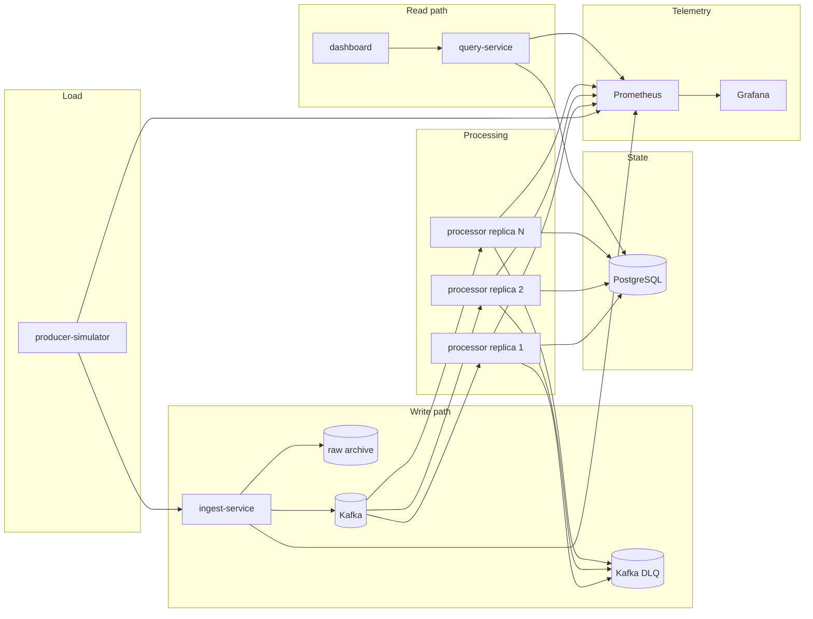
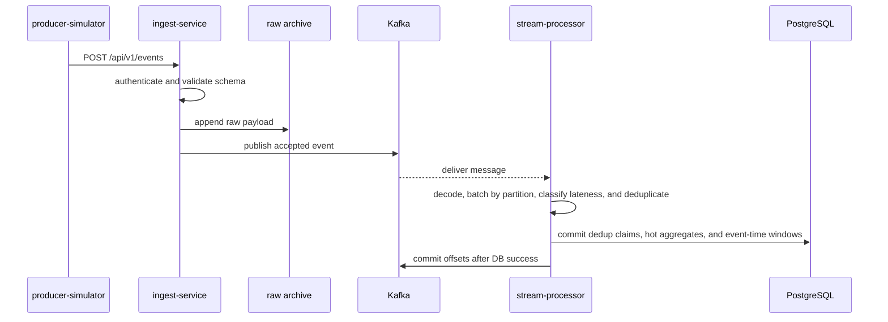
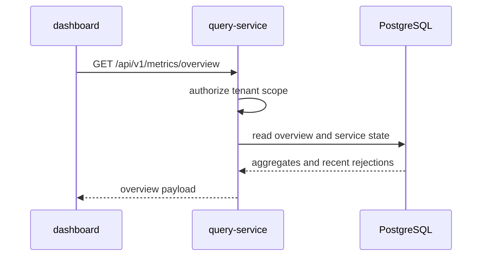
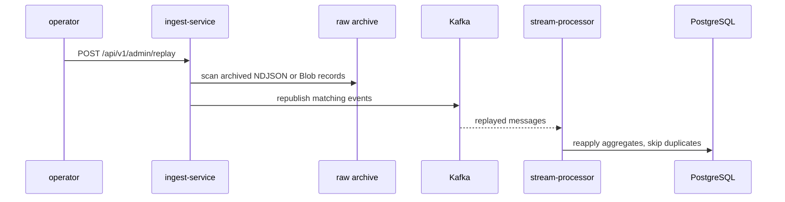
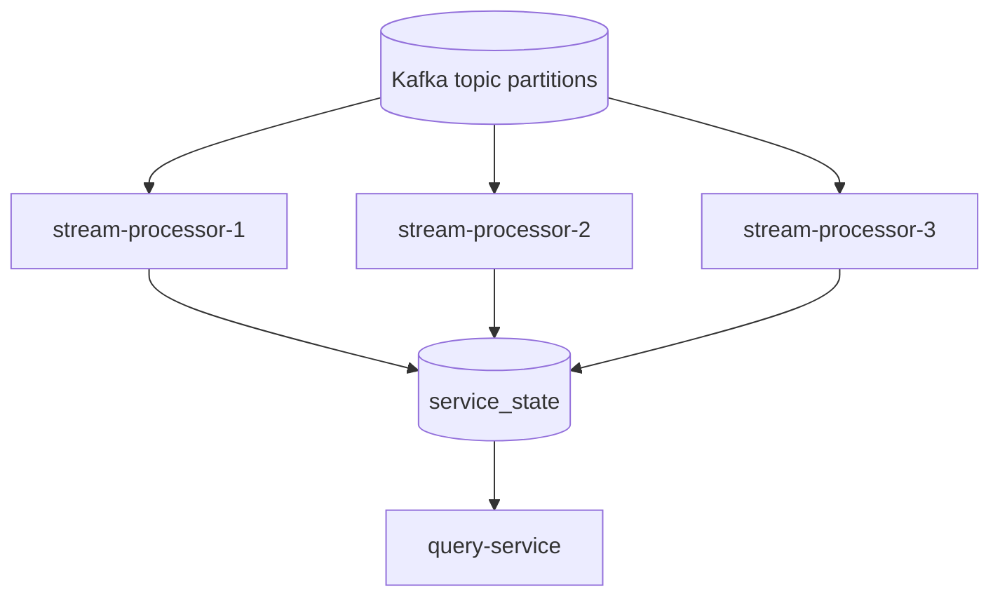

# Architecture

## Scope

PulseStream is a local-first event analytics platform that emphasizes distributed-systems concerns over product breadth. The current implementation focuses on ingestion, streaming aggregation, replay, observability, tenant isolation, and measurable failure behavior.

## System diagram

## Components

- `producer-simulator`: emits synthetic telemetry at configurable rates, including duplicates, malformed payloads, and burst traffic
- `ingest-service`: authenticates producers, validates event payloads, records rejections, archives raw events, publishes accepted events to Kafka, and exposes the replay endpoint
- `raw archive`: immutable NDJSON or Blob-backed event log written before broker publish, used for replay and backfills
- `stream-processor`: consumes Kafka partitions, processes partitions in parallel while preserving per-partition ordering, batches hot writes, deduplicates by `event_id`, classifies late events, dead-letters poison records, computes hot and event-time aggregates, and stores per-instance service state snapshots
- `query-service`: exposes tenant-scoped low-latency operational APIs for dashboard reads
- `PostgreSQL`: hot store for aggregate buckets, source counters, rejection history, deduplication state, row-level security, and service state
- `Kafka`: durable broker between write and processing paths, with a dedicated DLQ topic for processor-side poison messages
- `dashboard`: React UI for throughput, lag, latency, and rejection visibility
- `Prometheus` and `Grafana`: metrics collection and local operational visibility
- `asyncapi.yaml` plus JSON Schemas: checked-in asynchronous contract for Kafka topics, headers, and payloads

## Write path

Poison-message path:

`Kafka -> stream-processor -> pulsestream.events.dlq`

## Read path

## Replay path

## Processor scaling model

Each processor replica writes an instance-scoped heartbeat and metric snapshot into `service_state`. The query layer only reads recent snapshots, so stopped or replaced replicas do not continue to count as active capacity.

## Design decisions

| Decision | Current choice | Reason |
| --- | --- | --- |
| Broker | Kafka locally, Event Hubs-compatible settings for Azure | Kafka gives strong local reproducibility and direct visibility into partitions, offsets, and consumer groups |
| Hot store | PostgreSQL | One operational store is simpler than a Redis plus PostgreSQL split at this stage |
| Delivery semantics | Idempotent at-least-once | Easier to implement and explain than exactly-once while still demonstrating correctness controls |
| Cold path | Local NDJSON archive plus Blob-backed archive option | Supports replay and rebuild locally while preserving an Azure durability path |
| Local deployment | Docker Compose | Faster iteration and lower operational overhead than Kubernetes for the current stage |
| Replica observability | Prometheus Docker service discovery | Allows local processor scaling evidence without static scrape targets |
| Poison-message handling | Dedicated Kafka DLQ | Keeps processor-side bad records from blocking the consumer loop |
| Contract governance | AsyncAPI plus JSON Schema | Kafka topics and payloads are versioned in source control and validated in CI |
| Stream framework | Custom Go processor, with Flink and Kafka Streams as reference standards | Throughput and semantics should be credible before adding a framework dependency |

## Data owned by PostgreSQL

- `tenant_metrics`: legacy 10-second tenant aggregate buckets kept in rollup reads for compatibility
- `tenant_metric_shards`: current 10-second tenant aggregate shards used to reduce hot-row contention under high load
- `source_metrics`: cumulative source counts for top-N queries
- `event_windows`: fixed 1-minute and 5-minute event-time windows by tenant and source
- `processed_events`: deduplication keys
- `rejection_events`: ingest-side validation and publish failures
- `service_state`: per-instance snapshots for ingest, query, and processor services

## Operational notes

- Request tracing is wired in through OpenTelemetry, but trace export is disabled by default for throughput runs.
- Prometheus scrapes services directly from Docker discovery metadata rather than static target lists.
- Grafana is provisioned only as a local visualization layer. The query API remains the system-of-record read surface for the dashboard.
- Processor snapshot payloads carry `dead_letter_total`, `late_event_total`, active partitions, per-partition ownership, in-flight message count, batch flush metrics, and p50/p95/p99 processing latency.
- New local archive records are partitioned by UTC day, tenant, and hour. Replay still falls back to the legacy date-only layout for older artifacts.

## Azure deployment path

The first Azure deployment variant uses:

- Azure Event Hubs as the Kafka endpoint
- Azure Blob Storage for raw archive durability and replay scanning
- Azure Container Apps for `ingest-service`, `query-service`, and `stream-processor`
- Azure Log Analytics through the Container Apps environment
- system-assigned managed identity on `ingest-service` for Blob access
- existing PostgreSQL and Event Hubs credentials injected as Container Apps secrets

This path provides a durable Azure replay archive. The main remaining Azure gaps are dashboard deployment parity, infrastructure provisioning for backing services, and published Azure benchmark evidence.
