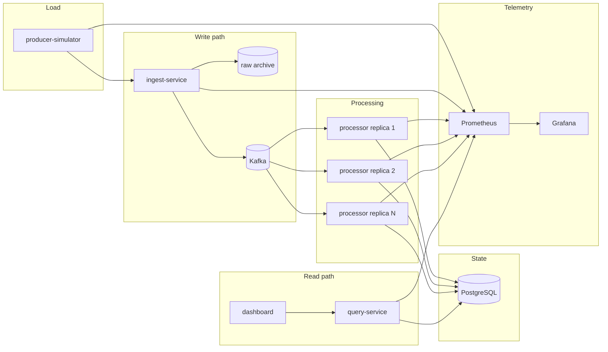
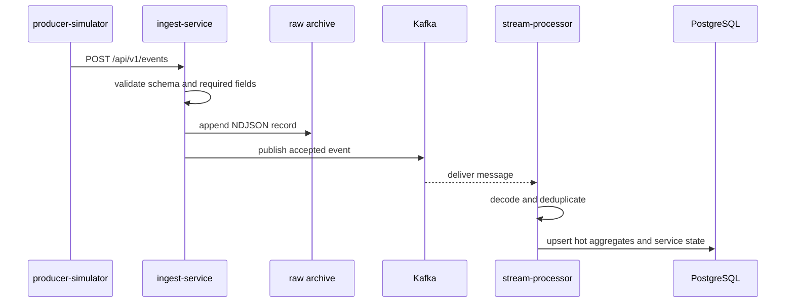
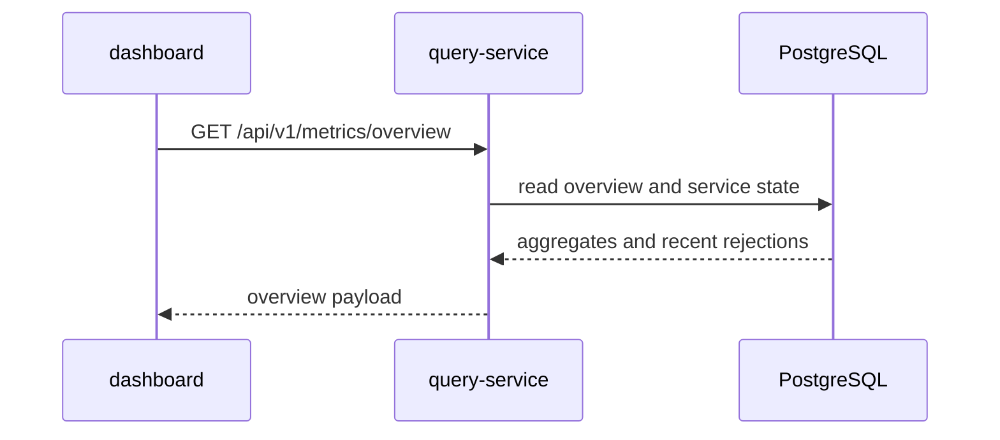
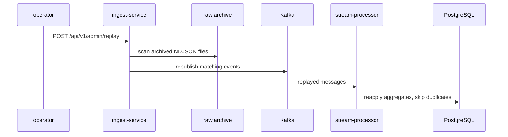
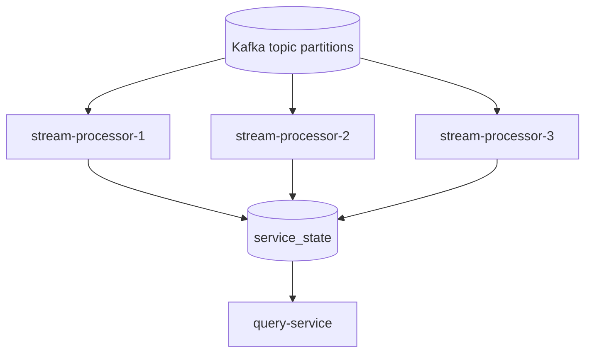

# Architecture

## Scope

PulseStream is a local-first event analytics platform that emphasizes distributed-systems concerns over product breadth. The current implementation focuses on ingestion, streaming aggregation, replay, observability, and measurable failure behavior.

## System diagram

## Write path

## Read path

## Replay path

## Processor scaling model

Each processor replica writes an instance-scoped heartbeat and metric snapshot into `service_state`. The query layer only reads recent snapshots, so stopped or replaced replicas do not continue to count as active capacity.

## Design decisions

| Decision | Current choice | Reason |
| --- | --- | --- |
| Broker | Kafka | Strong local reproducibility and direct visibility into partitions, offsets, and consumer groups |
| Hot store | PostgreSQL | One operational store is simpler than a Redis plus PostgreSQL split at this stage |
| Delivery semantics | Idempotent at-least-once | Easier to implement and explain than exactly-once while still demonstrating correctness controls |
| Cold path | Local NDJSON archive | Supports replay and rebuild without requiring cloud object storage |
| Local deployment | Docker Compose | Faster iteration and lower operational overhead than Kubernetes for the current stage |
| Replica observability | Prometheus Docker service discovery | Allows local processor scaling evidence without static scrape targets |

## Data owned by PostgreSQL

- `tenant_metrics`: 10-second aggregate buckets for tenant charts
- `source_metrics`: cumulative source counts for top-N queries
- `processed_events`: deduplication keys
- `rejection_events`: ingest-side validation and publish failures
- `service_state`: per-instance snapshots for ingest, query, and processor services

## Operational notes

- Request tracing is wired in through OpenTelemetry, but trace export is disabled by default for throughput runs.
- Prometheus scrapes services directly from Docker discovery metadata rather than static target lists.
- Grafana is provisioned only as a local visualization layer. The query API remains the system-of-record read surface for the dashboard.
