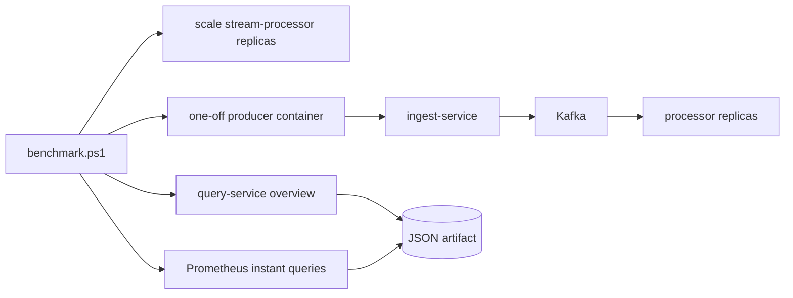

# Benchmarking

## Purpose

The benchmark harness is used to measure throughput, lag, and query latency under a controlled synthetic load profile. The current goal is not headline throughput. The goal is defensible evidence for how the system behaves under load and how that behavior changes after engineering changes.

## Benchmark harness



## Environment

The most recent local artifacts were captured on:

- OS: `Microsoft Windows 11 Pro`
- CPU: `6` logical CPUs
- Memory: `15.94 GiB`
- Deployment: Docker Desktop with Docker Compose

## Procedure

1. Start the local stack.

   ```powershell
   docker compose -f deploy/docker-compose/docker-compose.yml up --build
   ```

2. Run the current performance gate.

   ```powershell
   ./scripts/load-test/run-performance-gate.ps1 -Rate 2000 -DurationSeconds 60 -WarmupSeconds 10 -ProcessorReplicas 3 -ProducerCount 4 -BatchSize 25 -MaxInFlight 768 -TenantCount 50 -SourcesPerTenant 200
   ```

   Use `-AllowGateFailure` when you want a bottleneck artifact even if the gate fails. Use `-ResetVolumes` only when you deliberately want to remove Kafka, PostgreSQL, and Prometheus state before the run.

3. Run a custom benchmark.

   ```powershell
   ./scripts/load-test/benchmark.ps1 -Rate 1500 -DurationSeconds 30 -WarmupSeconds 5 -ProcessorReplicas 3
   ```

   For higher offered load, split the target rate across multiple simulator instances:

   ```powershell
   ./scripts/load-test/benchmark.ps1 -Rate 5000 -ProducerCount 4 -BatchSize 25 -DurationSeconds 60 -WarmupSeconds 10 -ProcessorReplicas 3 -MaxInFlight 1024 -TenantCount 50 -SourcesPerTenant 200
   ```

4. Review the generated JSON artifact under `artifacts/benchmarks/`.

The harness:

- stops the steady-state simulator so the run is isolated
- optionally scales `stream-processor` before the run
- waits for the exact processor replica count to appear in Prometheus
- runs one or more one-off producer containers inside the Docker network
- sends through `/api/v1/events/batch` automatically when `-BatchSize` is greater than `1`
- assigns each producer a unique `SIM_PRODUCER_ID` so generated `event_id` values do not collide
- samples `GET /api/v1/metrics/overview`
- reads ingest and processor counters through Prometheus instant queries
- captures ingest validation/archive/publish stage latency and processor stage latency histograms
- stops load generators at the end of the offered-load window and records post-load drain time
- records requested and observed processor replica counts
- writes explicit pass/fail gates for processed eps, query p95, and drain time
- refreshes `artifacts/evidence/latest.json` so the dashboard and `GET /api/v1/evidence/latest` show the latest benchmark evidence

The gate wrapper adds:

- stack startup with one retry for transient Compose dependency-health races
- optional volume reset
- evidence schema validation
- non-zero exit when gates fail, unless `-AllowGateFailure` is set

## Metrics captured

| Metric | Meaning |
| --- | --- |
| `producer_sent_eps` | events attempted by the benchmark producer |
| `accepted_eps` | events accepted by the ingest service |
| `processed_eps` | events written into hot views by the processor |
| `peak_consumer_lag` | highest aggregated lag observed during the run |
| `peak_processing_p50_ms`, `p95`, `p99` | processor latency window maxima observed during the run |
| `query_latency_p50_ms`, `p95`, `p99` | latency of the overview API as measured by the harness |
| `post_load_drain_seconds` | seconds for consumer lag to return to the pre-run level after producers stop |
| `ingest_stage_latency_ms` | p50/p95/p99 for validation, archive write, and Kafka publish histograms |
| `stage_latency_ms` | p50/p95/p99 for dedup claim, tenant/source/window upserts, DB commit, and Kafka offset commit |
| `gates` | pass/fail status for the current evidence thresholds |
| `processor_replicas_observed` | exact replica count confirmed through Prometheus |
| `producer_count` | number of load-generator instances used by the benchmark |
| `batch_size` | number of events per producer HTTP request; values greater than `1` use the batch ingest endpoint |

## Evidence table

| Date | Rate target | Duration | Accepted eps | Processed eps | P95 ms | P99 ms | Lag peak | Notes |
| --- | --- | --- | --- | --- | --- | --- | --- | --- |
| 2026-04-10 | 1500 | 14s | 1209.48 | 330.52 | 18 | 28 | 52656 | pre-optimization baseline, artifact `artifacts/benchmarks/benchmark-20260410-191942.json` |
| 2026-04-10 | 1500 | 14s | 1219.12 | 875.72 | 21 | 38 | 198421 | partition-parallel processor and single-statement hot-store write, artifact `artifacts/benchmarks/benchmark-20260410-194727.json` |
| 2026-04-10 | 1500 | 33s | 713.09 | 568.43 | 14 | 23 | 1308 | exact-count harness, `1` processor replica, artifact `artifacts/benchmarks/benchmark-20260410-212955.json` |
| 2026-04-10 | 1500 | 33s | 700.37 | 595.02 | 11 | 19 | 1246 | exact-count harness, `3` processor replicas, artifact `artifacts/benchmarks/benchmark-20260410-213110.json` |
| 2026-04-17 | 5000 | 63.1s | 955.91 | 329.37 | 243 | 432 | 10969 | `4` producers, `3` processor replicas, `50` tenants, `200` sources per tenant, artifact `artifacts/benchmarks/benchmark-20260417-222710.json`; target not met |
| 2026-04-20 | 2000 | 60.77s | 717.1 | 495.08 | 336 | 2997 | 5114 | performance gate wrapper, `4` producers, `3` processor replicas, `50` tenants, `200` sources per tenant, artifact `artifacts/benchmarks/benchmark-performance-gate-20260420-160655.json`; target not met |
| 2026-04-23 | 2000 | 60.94s | 1308.55 | 1166.05 | 40 | 67 | 273 | async archive plus set-based aggregate writes, `4` producers, `3` processor replicas, artifact `artifacts/benchmarks/benchmark-performance-gate-20260423-123425.json`; best post-fix run, target not met |
| 2026-04-23 | 2000 | 61.12s | 1262.27 | 1103.11 | 85 | 214 | 74 | higher ingest in-flight cap experiment, artifact `artifacts/benchmarks/benchmark-performance-gate-20260423-124031.json`; target not met |
| 2026-04-23 | 2000 | 60.53s | 1091.64 | 1137.95 | 77 | 198 | 1157 | Kafka publish batcher experiment, artifact `artifacts/benchmarks/benchmark-performance-gate-20260423-124638.json`; publish latency regressed, target not met |
| 2026-04-23 | 2000 | 60.53s | 898.67 | 910.44 | 69 | 182 | 0 | pre-batch evidence run with batcher disabled, artifact `artifacts/benchmarks/benchmark-performance-gate-20260423-124945.json`; target not met |
| 2026-04-23 | 2000 | 60.83s | 1973.53 | 2030.64 | 125 | 345 | 0 | batch ingest endpoint, `4` producers, `3` processor replicas, batch size `25`, artifact `artifacts/benchmarks/benchmark-performance-gate-20260423-131819.json`; 2k gate met |
| 2026-04-23 | 5000 | 60.24s | 4980.08 | 4962.23 | 27 | 67 | 163 | batch ingest endpoint, `4` producers, `3` processor replicas, batch size `25`, artifact `artifacts/benchmarks/benchmark-20260423-132558.json`; 5k gate narrowly not met |
| 2026-04-23 | 5000 | 60.4s | 4971.03 | 5101.71 | 18 | 41 | 0 | sharded tenant aggregate table, `4` producers, `3` processor replicas, batch size `25`, artifact `artifacts/benchmarks/benchmark-20260423-175006.json`; 5k gate met |

## MVP gate status

| Gate | Target | Current result | Status |
| --- | --- | --- | --- |
| Intermediate throughput | sustain `2,000 processed eps` locally | latest sharded 5k run processed `5,101.71 eps` | Met |
| MVP throughput | sustain `5,000 processed eps` locally | latest sharded 5k run processed `5,101.71 eps` | Met once locally |
| Query latency | dashboard/API p95 below `250 ms` | latest sharded 5k run query p95 was `54.91 ms` | Met |
| Post-load drain | lag returns to pre-run level within `30s` | latest sharded 5k run drained in `2.05s` | Met |
| Processor recovery | consumer restart recovers without data loss at sustainable rate | restart drill recovered lag in `6.29s` at `300 eps` with `3` processor replicas | Met at controlled rate |
| Broker failure accounting | publish failures visible and archive accounting closed | broker outage had archive accounting gap `0` and accepted traffic recovered in `2.09s` | Met |
| Replay/idempotency | replay does not overcount hot views | `25` duplicate replays produced `0` source-metric overcount; rebuild restored hot views | Met |

## Generated evidence summary

Benchmark and chaos scripts now refresh a normalized evidence file:

```powershell
./scripts/evidence/update-evidence.ps1
```

Output:

- `artifacts/evidence/latest.json`
- `schema_version: 1`
- latest benchmark summary
- latest known result for each required failure drill
- explicit remaining gaps that should not be hidden in the dashboard narrative
- explicit benchmark gates so the dashboard can show pass/fail instead of prose-only claims

The schema is validated in CI with:

```powershell
npm run evidence:validate
```

The committed example is `docs/evidence.example.json`. Runtime artifacts remain ignored by Git because they are local benchmark output.

## Interpretation

- The processor hot path uses bounded per-partition batches, batch ingest, and sharded tenant aggregate upserts. The latest local run meets both the 2k and 5k processed-eps gates once.
- Multi-producer generation prevents a single simulator process from being the only limiter, and `SIM_PRODUCER_ID` prevents synthetic `event_id` collisions across producers.
- The latest batch 2k gate accepted `1,973.53 eps` from an offered `2,000 eps` and processed `2,030.64 eps`. The older one-event HTTP profile accepted only `898.67 eps`, which shows why the batch ingest path is the current credible producer model.
- The latest sharded 5k benchmark accepted `4,971.03 eps` and processed `5,101.71 eps`. Query latency and drain time pass, but repeatability still needs multiple clean-state runs.
- Backpressure rejections are now metric-only instead of being written to PostgreSQL rejection rows, which avoids amplifying database load during overload.
- Poison-message handling is verified separately in `artifacts/failure-drills/inject-poison-message-20260417-193308.json` so malformed direct-to-Kafka records can be tested without distorting the hot benchmark stream.
- Processor scale-out exposed a startup DDL deadlock in schema initialization. The fix adds a schema migration marker plus retry around PostgreSQL deadlock and serialization errors so additional processor replicas do not repeatedly run the full DDL block.
- The optional Kafka publish batcher is implemented behind `KAFKA_PUBLISH_BATCHER_ENABLED`, but the 2026-04-23 local experiment regressed Kafka publish p95. It remains disabled in the Compose benchmark profile.

## Current bottleneck

The next performance limitation is no longer the one-event HTTP ingest path or the unsharded tenant aggregate row. The latest sharded batch evidence shows the 5k gate passing once locally. The next measurable risk is repeatability under clean-state reruns and post-change failure behavior.

Measured slow stages before the 2026-04-23 fixes from `artifacts/benchmarks/benchmark-performance-gate-20260420-160655.json`:

- Ingest archive write: `p95 3827.14 ms`
- Ingest Kafka publish: `p95 2149.53 ms`
- Processor tenant aggregate upsert: `p95 7843.38 ms`
- Processor window aggregate upsert: `p95 1869.98 ms`
- Processor dedup claim: `p95 334.03 ms`

Measured slow stages after the 2026-04-23 fixes from the best post-fix run, `artifacts/benchmarks/benchmark-performance-gate-20260423-123425.json`:

- Ingest archive step: `p95 4.76 ms`
- Ingest Kafka publish: `p95 705.11 ms`
- Processor tenant aggregate upsert: `p95 746 ms`
- Processor window aggregate upsert: `p95 47.78 ms`
- Processor dedup claim: `p95 40.63 ms`

Measured slow stages from the latest run, `artifacts/benchmarks/benchmark-performance-gate-20260423-124945.json`:

- Ingest archive step: `p95 4.76 ms`
- Ingest Kafka publish: `p95 1738.8 ms`
- Processor tenant aggregate upsert: `p95 650.45 ms`
- Processor window aggregate upsert: `p95 43.93 ms`
- Processor dedup claim: `p95 30.59 ms`

Measured slow stages from the latest batch run, `artifacts/benchmarks/benchmark-performance-gate-20260423-131819.json`:

- Ingest validation: `p95 4.79 ms`
- Ingest archive step: `p95 4.76 ms`
- Ingest Kafka publish: `p95 40.39 ms`
- Processor tenant aggregate upsert: `p95 104.15 ms`
- Processor window aggregate upsert: `p95 9.47 ms`
- Processor dedup claim: `p95 9.8 ms`

Measured slow stages from the latest 5k batch run, `artifacts/benchmarks/benchmark-20260423-132558.json`:

- Ingest validation: `p95 4.83 ms`
- Ingest archive step: `p95 4.76 ms`
- Ingest Kafka publish: `p95 39.09 ms`
- Processor tenant aggregate upsert: `p95 558.48 ms`
- Processor window aggregate upsert: `p95 35.5 ms`
- Processor dedup claim: `p95 26.94 ms`

Measured slow stages from the latest sharded 5k run, `artifacts/benchmarks/benchmark-20260423-175006.json`:

- Ingest validation: `p95 4.89 ms`
- Ingest archive step: `p95 4.78 ms`
- Ingest Kafka publish: `p95 113.31 ms`
- Processor tenant aggregate upsert: `p95 141.7 ms`
- Processor window aggregate upsert: `p95 38.54 ms`
- Processor dedup claim: `p95 42.67 ms`

The benchmark evidence is useful because it shows that sharding tenant aggregates reduced the 5k tenant aggregate p95 from `558.48 ms` to `141.7 ms` and moved processed throughput from `4,962.23 eps` to `5,101.71 eps`.

The next defensible benchmark step is one of:

- repeat the `5,000 eps` sharded batch profile on clean state to establish variance
- rerun restart, broker-outage, Postgres-pause, replay, and poison-message drills against the new batch/sharded hot path
- profile Kafka publish p99 and dedup claim p99 under the passing 5k profile
- profile processor PostgreSQL write latency and batch behavior under sustained backlog
- run the same profile on stronger local hardware or a cloud deployment where producer, broker, and database capacity can be scaled independently
