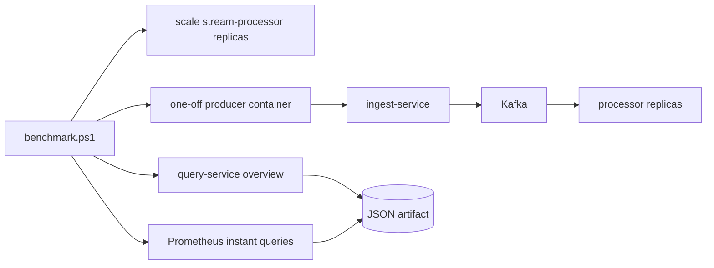

# Benchmarking

## Purpose

The benchmark harness is used to measure throughput, lag, and query latency under a controlled synthetic load profile. The current goal is not headline throughput. The goal is defensible evidence for how the system behaves under load and how that behavior changes after engineering changes.

## Benchmark harness



## Environment

The most recent local artifacts were captured on:

- OS: `Microsoft Windows 11 Pro`
- CPU: `6` logical CPUs
- Memory: `15.94 GiB`
- Deployment: Docker Desktop with Docker Compose

## Procedure

1. Start the local stack.

   ```powershell
   docker compose -f deploy/docker-compose/docker-compose.yml up --build
   ```

2. Run a benchmark.

   ```powershell
   ./scripts/load-test/benchmark.ps1 -Rate 1500 -DurationSeconds 30 -WarmupSeconds 5 -ProcessorReplicas 3
   ```

3. Review the generated JSON artifact under `artifacts/benchmarks/`.

The harness:

- stops the steady-state simulator so the run is isolated
- optionally scales `stream-processor` before the run
- waits for the exact processor replica count to appear in Prometheus
- runs a one-off producer container inside the Docker network
- samples `GET /api/v1/metrics/overview`
- reads ingest and processor counters through Prometheus instant queries

## Metrics captured

| Metric | Meaning |
| --- | --- |
| `producer_sent_eps` | events attempted by the benchmark producer |
| `accepted_eps` | events accepted by the ingest service |
| `processed_eps` | events written into hot views by the processor |
| `peak_consumer_lag` | highest aggregated lag observed during the run |
| `peak_processing_p50_ms`, `p95`, `p99` | processor latency window maxima observed during the run |
| `query_latency_p50_ms`, `p95`, `p99` | latency of the overview API as measured by the harness |
| `processor_replicas_observed` | exact replica count confirmed through Prometheus |

## Evidence table

| Date | Rate target | Duration | Accepted eps | Processed eps | P95 ms | P99 ms | Lag peak | Notes |
| --- | --- | --- | --- | --- | --- | --- | --- | --- |
| 2026-04-10 | 1500 | 14s | 1209.48 | 330.52 | 18 | 28 | 52656 | pre-optimization baseline, artifact `artifacts/benchmarks/benchmark-20260410-191942.json` |
| 2026-04-10 | 1500 | 14s | 1219.12 | 875.72 | 21 | 38 | 198421 | partition-parallel processor and single-statement hot-store write, artifact `artifacts/benchmarks/benchmark-20260410-194727.json` |
| 2026-04-10 | 1500 | 33s | 713.09 | 568.43 | 14 | 23 | 1308 | exact-count harness, `1` processor replica, artifact `artifacts/benchmarks/benchmark-20260410-212955.json` |
| 2026-04-10 | 1500 | 33s | 700.37 | 595.02 | 11 | 19 | 1246 | exact-count harness, `3` processor replicas, artifact `artifacts/benchmarks/benchmark-20260410-213110.json` |

## Interpretation

- The processor hot path improved substantially after the partition-parallel runner and the single-statement PostgreSQL write path were introduced.
- The current scale-aware comparison shows a modest but real gain from `3` processor replicas relative to `1` replica under the same benchmark harness.
- The latest pair should be read carefully: the producer path only sustained about `700-860 eps`, so processor scaling is no longer the only limiting factor in that profile.
- Query latency remained low in all recent artifacts, which supports the claim that hot-view reads remain cheap under concurrent write load.

## Current bottleneck

The next performance limitation is not solely the processor. The producer path now limits higher-rate local runs, which makes the scaling evidence directionally useful but not yet a hard upper bound for the processor group.

The next defensible benchmark step is one of:

- increase producer-side parallelism
- run a stronger local load generator profile
- capture the same benchmark in a cloud deployment where producer and broker capacity can be pushed further
