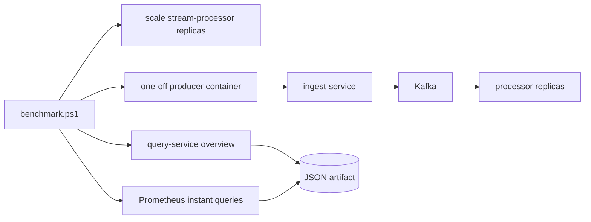

# Benchmarking

## Purpose

The benchmark harness is used to measure throughput, lag, and query latency under a controlled synthetic load profile. The current goal is not headline throughput. The goal is defensible evidence for how the system behaves under load and how that behavior changes after engineering changes.

## Benchmark harness



## Environment

The most recent local artifacts were captured on:

- OS: `Microsoft Windows 11 Pro`
- CPU: `6` logical CPUs
- Memory: `15.94 GiB`
- Deployment: Docker Desktop with Docker Compose

## Procedure

1. Start the local stack.

   ```powershell
   docker compose -f deploy/docker-compose/docker-compose.yml up --build
   ```

2. Run a benchmark.

   ```powershell
   ./scripts/load-test/benchmark.ps1 -Rate 1500 -DurationSeconds 30 -WarmupSeconds 5 -ProcessorReplicas 3
   ```

   For higher offered load, split the target rate across multiple simulator instances:

   ```powershell
   ./scripts/load-test/benchmark.ps1 -Rate 5000 -ProducerCount 4 -DurationSeconds 60 -WarmupSeconds 10 -ProcessorReplicas 3 -MaxInFlight 1024 -TenantCount 50 -SourcesPerTenant 200
   ```

3. Review the generated JSON artifact under `artifacts/benchmarks/`.

The harness:

- stops the steady-state simulator so the run is isolated
- optionally scales `stream-processor` before the run
- waits for the exact processor replica count to appear in Prometheus
- runs one or more one-off producer containers inside the Docker network
- assigns each producer a unique `SIM_PRODUCER_ID` so generated `event_id` values do not collide
- samples `GET /api/v1/metrics/overview`
- reads ingest and processor counters through Prometheus instant queries
- captures ingest validation/archive/publish stage latency and processor stage latency histograms
- stops load generators at the end of the offered-load window and records post-load drain time
- records requested and observed processor replica counts
- writes explicit pass/fail gates for processed eps, query p95, and drain time
- refreshes `artifacts/evidence/latest.json` so the dashboard and `GET /api/v1/evidence/latest` show the latest benchmark evidence

## Metrics captured

| Metric | Meaning |
| --- | --- |
| `producer_sent_eps` | events attempted by the benchmark producer |
| `accepted_eps` | events accepted by the ingest service |
| `processed_eps` | events written into hot views by the processor |
| `peak_consumer_lag` | highest aggregated lag observed during the run |
| `peak_processing_p50_ms`, `p95`, `p99` | processor latency window maxima observed during the run |
| `query_latency_p50_ms`, `p95`, `p99` | latency of the overview API as measured by the harness |
| `post_load_drain_seconds` | seconds for consumer lag to return to the pre-run level after producers stop |
| `ingest_stage_latency_ms` | p50/p95/p99 for validation, archive write, and Kafka publish histograms |
| `stage_latency_ms` | p50/p95/p99 for dedup claim, tenant/source/window upserts, DB commit, and Kafka offset commit |
| `gates` | pass/fail status for the current evidence thresholds |
| `processor_replicas_observed` | exact replica count confirmed through Prometheus |
| `producer_count` | number of load-generator instances used by the benchmark |

## Evidence table

| Date | Rate target | Duration | Accepted eps | Processed eps | P95 ms | P99 ms | Lag peak | Notes |
| --- | --- | --- | --- | --- | --- | --- | --- | --- |
| 2026-04-10 | 1500 | 14s | 1209.48 | 330.52 | 18 | 28 | 52656 | pre-optimization baseline, artifact `artifacts/benchmarks/benchmark-20260410-191942.json` |
| 2026-04-10 | 1500 | 14s | 1219.12 | 875.72 | 21 | 38 | 198421 | partition-parallel processor and single-statement hot-store write, artifact `artifacts/benchmarks/benchmark-20260410-194727.json` |
| 2026-04-10 | 1500 | 33s | 713.09 | 568.43 | 14 | 23 | 1308 | exact-count harness, `1` processor replica, artifact `artifacts/benchmarks/benchmark-20260410-212955.json` |
| 2026-04-10 | 1500 | 33s | 700.37 | 595.02 | 11 | 19 | 1246 | exact-count harness, `3` processor replicas, artifact `artifacts/benchmarks/benchmark-20260410-213110.json` |
| 2026-04-17 | 5000 | 63.1s | 955.91 | 329.37 | 243 | 432 | 10969 | `4` producers, `3` processor replicas, `50` tenants, `200` sources per tenant, artifact `artifacts/benchmarks/benchmark-20260417-222710.json`; target not met |

## MVP gate status

| Gate | Target | Current result | Status |
| --- | --- | --- | --- |
| Intermediate throughput | sustain `2,000 processed eps` locally | latest published evidence is `329.37 processed eps`; rerun required after batch processor change | Not met |
| MVP throughput | sustain `5,000 processed eps` locally | latest published evidence is `329.37 processed eps`; rerun required after batch processor change | Not met |
| Query latency | dashboard/API p95 below refresh interval | overview query p95 `147.13 ms` in the latest 5k offered-load run | Met for current load |
| Post-load drain | lag returns to pre-run level within `30s` | new harness records this; old artifact did not | Needs rerun |
| Processor recovery | consumer restart recovers without data loss at sustainable rate | restart drill recovered lag in `6.29s` at `300 eps` with `3` processor replicas | Met at controlled rate |
| Broker failure accounting | publish failures visible and archive accounting closed | broker outage had archive accounting gap `0` and accepted traffic recovered in `2.09s` | Met |
| Replay/idempotency | replay does not overcount hot views | `25` duplicate replays produced `0` source-metric overcount; rebuild restored hot views | Met |

## Generated evidence summary

Benchmark and chaos scripts now refresh a normalized evidence file:

```powershell
./scripts/evidence/update-evidence.ps1
```

Output:

- `artifacts/evidence/latest.json`
- `schema_version: 1`
- latest benchmark summary
- latest known result for each required failure drill
- explicit remaining gaps that should not be hidden in the dashboard narrative
- explicit benchmark gates so the dashboard can show pass/fail instead of prose-only claims

The schema is validated in CI with:

```powershell
npm run evidence:validate
```

The committed example is `docs/evidence.example.json`. Runtime artifacts remain ignored by Git because they are local benchmark output.

## Interpretation

- The processor hot path now uses bounded per-partition batches. Published evidence predates that change and must be regenerated before making a new throughput claim.
- Multi-producer generation prevents a single simulator process from being the only limiter, and `SIM_PRODUCER_ID` prevents synthetic `event_id` collisions across producers.
- The latest published 5k offered-load run still fails the throughput gate. Accepted throughput is below 20 percent of target and processed throughput is below 10 percent of target.
- Query latency is not the current bottleneck. The latest run kept overview query p95 at `147.13 ms`.
- Backpressure rejections are now metric-only instead of being written to PostgreSQL rejection rows, which avoids amplifying database load during overload.
- Poison-message handling is verified separately in `artifacts/failure-drills/inject-poison-message-20260417-193308.json` so malformed direct-to-Kafka records can be tested without distorting the hot benchmark stream.

## Current bottleneck

The next performance limitation is not solely the processor. The local high-rate path is constrained by producer/client timeouts, ingest publish/archive pressure, Kafka write behavior under load, and PostgreSQL hot-view writes. The benchmark evidence is useful because it shows where the system fails, but it should not be presented as a 5k eps success.

The next defensible benchmark step is one of:

- profile ingest request handling and Kafka writer flush behavior under the `5,000 eps` offered-load run
- profile processor PostgreSQL write latency and batch behavior under sustained backlog
- rerun the `5,000 eps` profile after batching and compare stage histograms before making any improvement claim
- run the same profile on stronger local hardware or a cloud deployment where producer, broker, and database capacity can be scaled independently
