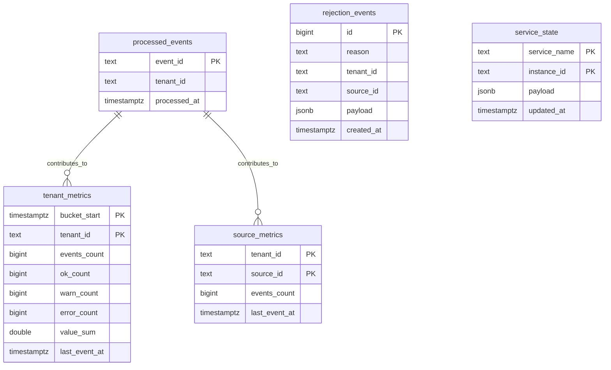

# Data Model

## Telemetry event

```json
{
  "schema_version": 1,
  "event_id": "uuid-or-deterministic-id",
  "tenant_id": "tenant_123",
  "source_id": "sensor_42",
  "event_type": "telemetry",
  "timestamp": "2026-04-08T18:00:00Z",
  "value": 73.4,
  "status": "ok",
  "region": "eu-west",
  "sequence": 104424
}
```

## Event constraints

| Field | Constraint |
| --- | --- |
| `schema_version` | required, currently fixed at `1` |
| `event_id` | required, unique across the processed stream |
| `tenant_id` | required |
| `source_id` | required |
| `timestamp` | UTC RFC3339 timestamp |
| `status` | one of `ok`, `warn`, `error` |
| `value` | numeric |

The formal JSON Schema is in [schemas/telemetry-event-v1.schema.json](/C:/Projects/real-time-event-processing-fabric/schemas/telemetry-event-v1.schema.json).

## Storage model



## Table semantics

| Table | Purpose |
| --- | --- |
| `processed_events` | Deduplication guard keyed by `event_id` |
| `tenant_metrics` | 10-second aggregate buckets used for throughput and status charts |
| `source_metrics` | Per-tenant cumulative source counters used for top-source queries |
| `rejection_events` | Records ingest validation failures and publish failures |
| `service_state` | Stores per-instance heartbeats and counters for ingest, processor, and query services |

## Raw archive

Accepted events are written to an immutable NDJSON archive partitioned by UTC day.

```text
RAW_ARCHIVE_DIR/
  2026/
    04/
      10/
        events.ndjson
```

Each line contains:

- `archived_at`
- the decoded `event`
- the original `raw_payload`

The raw archive provides the cold path for replay and hot-view rebuilds.

## Service state semantics

The `service_state` table uses `service_name + instance_id` as its key. This allows multiple processor replicas to report independently without overwriting each other.

The query layer ignores stale rows so that stopped or replaced replicas do not continue to count as live capacity.
