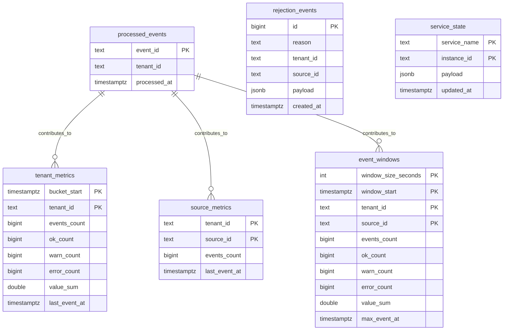

# Data Model

## Telemetry event

```json
{
  "schema_version": 1,
  "event_id": "uuid-or-deterministic-id",
  "tenant_id": "tenant_123",
  "source_id": "sensor_42",
  "event_type": "telemetry",
  "timestamp": "2026-04-08T18:00:00Z",
  "value": 73.4,
  "status": "ok",
  "region": "eu-west",
  "sequence": 104424
}
```

## Event constraints

| Field | Constraint |
| --- | --- |
| `schema_version` | required, currently fixed at `1` |
| `event_id` | required, unique across the processed stream |
| `tenant_id` | required |
| `source_id` | required |
| `timestamp` | UTC RFC3339 timestamp |
| `status` | one of `ok`, `warn`, `error` |
| `value` | numeric |

The formal JSON Schema is in [schemas/telemetry-event-v1.schema.json](../schemas/telemetry-event-v1.schema.json). The Kafka topic contract that references this schema is in [asyncapi.yaml](../asyncapi.yaml).

## Storage model



## Table semantics

| Table | Purpose |
| --- | --- |
| `processed_events` | Deduplication guard keyed by `event_id`; duplicate inserts skip aggregate updates |
| `tenant_metrics` | 10-second aggregate buckets used for throughput and status charts |
| `source_metrics` | Per-tenant cumulative source counters used for top-source queries |
| `event_windows` | Fixed 1-minute and 5-minute event-time windows keyed by tenant, source, window size, and deterministic window start |
| `rejection_events` | Records ingest validation failures and publish failures |
| `service_state` | Stores per-instance heartbeats and counters for ingest, processor, and query services |

## Event-time semantics

The processor assigns fixed event-time windows from the event timestamp:

```text
window_start = timestamp.UTC().Truncate(window_size)
```

The default window sizes are `1m` and `5m`. The default allowed lateness is `2m`. Events older than the partition-local high-water mark minus allowed lateness are still claimed in `processed_events` for deduplication, but they increment `late_event_total` and do not update `event_windows`.

## Raw archive

Accepted events are written to an immutable archive partitioned by UTC day, tenant, and hour for new records.

```text
RAW_ARCHIVE_DIR/
  2026/
    04/
      10/
        tenant_01/
          13/
            events.ndjson
```

Each line contains:

- `archived_at`
- the decoded `event`
- the original `raw_payload`

The raw archive provides the cold path for replay and hot-view rebuilds. The local archive uses NDJSON files; the Azure variant can use Blob Storage through the archive abstraction. Replay still supports the legacy date-only layout:

```text
RAW_ARCHIVE_DIR/2026/04/10/events.ndjson
```

## Dead-letter records

`pulsestream.events.dlq` stores processor-side poison messages that were already present in Kafka but could not be decoded or validated by the consumer. Each record includes:

- failure timestamp
- failure reason
- error string
- source topic, partition, and offset
- consumer group
- optional event metadata when it could be recovered
- base64-encoded original payload
- base64-encoded Kafka headers

The formal JSON Schema for this payload is in [schemas/dead-letter-record-v1.schema.json](../schemas/dead-letter-record-v1.schema.json).

## Service state semantics

The `service_state` table uses `service_name + instance_id` as its key. This allows multiple processor replicas to report independently without overwriting each other.

The query layer ignores stale rows so that stopped or replaced replicas do not continue to count as live capacity.

Processor snapshot payloads carry:

- `dead_letter_total`
- `late_event_total`
- `active_partitions`
- `inflight_messages`
- `partitions`
- `batch_size_p95`
- `batch_flush_p95_ms`
- `processing_p50_ms`
- `processing_p95_ms`
- `processing_p99_ms`
