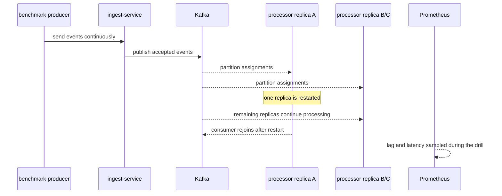

# Failure Modes

## Summary table

| Scenario | Trigger | Expected behavior | Current evidence |
| --- | --- | --- | --- |
| Processor restart during load | `./scripts/chaos/restart-processor.ps1` | ingest continues, lag rises, processor group resumes work | captured |
| Duplicate injection | simulator `SIM_DUPLICATE_EVERY` or archive replay | duplicates are accepted then discarded by the processor | captured through replay drill |
| Malformed ingest payload burst | simulator `SIM_MALFORMED_EVERY` | ingest rejects bad payloads and records rejection rows | captured in steady-state simulator activity |
| Poison message already in Kafka | `./scripts/chaos/inject-poison-message.ps1` | processor dead-letters the bad record and commits after DLQ publish | captured |
| PostgreSQL pause or slowdown | `./scripts/chaos/pause-postgres.ps1` | processor write path degrades and recovers after Postgres resumes | captured |
| Broker outage | `./scripts/chaos/broker-outage.ps1` | publish failures and backpressure become visible; processor survives broker loss | captured |
| Replay and rebuild | `./scripts/chaos/replay-archive.ps1` | archived events are republished, duplicates are ignored, and scoped hot views can be rebuilt | captured |

## Processor restart during load

### Single-replica evidence

- Artifact: `artifacts/failure-drills/restart-processor-20260410-192413.json`
- Result: `22,997` accepted events, `7,571` processed events, `0` new rejections
- Result: lag started high, peaked at `94,342`, and did not recover within the `30s` window

### Optimized single-replica evidence

- Artifact: `artifacts/failure-drills/restart-processor-20260410-194815.json`
- Result: `22,977` accepted events, `19,479` processed events, `0` new rejections
- Result: latency stayed at `13 ms p95` and `25 ms p99`, but backlog still did not drain inside the drill window

### Multi-replica evidence

- Artifact: `artifacts/failure-drills/restart-processor-20260410-212812.json`
- Configuration: `3` processor replicas, restart of one replica during active load
- Result: `27,406` accepted events, `31,860` processed events, `8,466` duplicates, `0` new rejections
- Result: lag started at `0`, peaked at `828`, and remained `828` at the end of the `30s` window
- Result: latency stayed at `11 ms p95` and `19 ms p99`

## Duplicate handling

- Mechanism: the processor writes `event_id` into `processed_events` and skips aggregate updates when the insert is not claimed
- Observable signal: `pulsestream_processor_duplicate_total`
- Captured proof: `artifacts/failure-drills/replay-archive-20260416173251.json`
- Result: replaying `25` already-processed events produced `25` duplicate discards and `0` source-metric overcount

## Malformed ingest payload handling

- Mechanism: ingest validation failures and decode failures are returned as `400` responses and written to `rejection_events`
- Observable signal: `pulsestream_ingest_rejected_total`
- Operator API: `GET /api/v1/metrics/rejections`
- Current state: the steady-state simulator can intentionally emit malformed payloads and the rejection timeline confirms that those failures are isolated from valid traffic

## Poison message already in Kafka

- Trigger: `./scripts/chaos/inject-poison-message.ps1` or write a malformed or semantically invalid record directly to Kafka
- Expected behavior: processor publishes one DLQ record, commits the source offset only after the DLQ write succeeds, and increments `dead_letter_total`
- Observed drill: `artifacts/failure-drills/inject-poison-message-20260411-152328.json`
- Observed behavior: the scripted drill paused the compose simulator, launched a temporary processor with a fresh consumer group at the current topic tail, wrote one malformed record directly to `pulsestream.events`, and moved the overview API from `dead_letter_total: 0` to `dead_letter_total: 1`
- Observed behavior: the DLQ record captured the failure reason, source topic, source offset, consumer group, and base64-encoded original payload
- Interpretation: processor-side poison messages are isolated without blocking the consumer loop, and the operator path can see the event through both the overview API and the DLQ topic even when the main consumer group is already carrying backlog

## PostgreSQL pause or slowdown

- Trigger: `./scripts/chaos/pause-postgres.ps1`
- Expected behavior: processor errors become visible quickly, read paths degrade, recovery begins when Postgres resumes
- Observed drill: `artifacts/failure-drills/pause-postgres-20260416-202040.json`
- Observed behavior: with an `800 eps` target load and a `12s` Postgres pause, ingest accepted `26,195` events and archived the same number of events while Postgres was unavailable
- Observed behavior: processor progress slowed but recovered inside the observation window; `processed_total_delta` was `19,275`, `peak_processor_inflight` was `485`, and processing resumed `1.24s` after Postgres reported healthy
- Observed behavior: query-service overview calls failed visibly during the pause; the drill recorded `3` overview failures and a peak overview latency of `3021.87ms`
- Observed behavior: the ingest backpressure gate recorded `875` rejections, `publish_failed` remained `0`, and `p95` / `p99` processor latency peaked at `23ms` / `45ms`
- Remaining gap: the producer log still contained `14` client-side timeouts and the final consumer lag remained elevated at `181,976`, so recovery mechanics work but the system still needs stronger drain capacity and cleaner overload behavior under DB stalls
- Interpretation: Postgres dependency failure is now measured instead of assumed; the hot-view write path degrades, read APIs surface the dependency failure, ingest preserves valid events through the archive and Kafka path, and processor recovery resumes after the database returns

## Broker outage

- Trigger: `./scripts/chaos/broker-outage.ps1`
- Expected behavior: ingest publish failures become visible quickly, accepted traffic drops during the outage window, the raw archive still retains valid requests, and the processor resumes consumption after broker health returns without crashing the service
- Observed drill before processor retry hardening: `artifacts/failure-drills/broker-outage-20260412-195145.json`
- Observed behavior before hardening: with an `800 eps` target load and a `12s` Kafka outage, the archive delta was `11,720`, accepted traffic increased by `8,722`, explicit `publish_failed` rejections increased by `2,000`, and the accounting gap remained `998`
- Observed behavior before hardening: the producer log showed large numbers of HTTP client timeouts and the processor log showed a fatal `fetch kafka message` panic when the broker connection was refused
- Observed drill after processor retry hardening: `artifacts/failure-drills/broker-outage-20260412-200340.json`
- Observed behavior after hardening: the archive delta increased by `26,160`, accepted traffic increased by `20,391`, explicit `publish_failed` rejections increased by `5,767`, and the accounting gap dropped to `2`
- Observed behavior after hardening: the processor stayed live and emitted `fetch_message_failed_retrying` warnings instead of exiting, accepted traffic recovered within the drill window, and `p95` / `p99` processing latency peaked at `47ms` / `143ms`
- Observed drill after ingest backpressure and drill-harness hardening: `artifacts/failure-drills/broker-outage-20260416-201249.json`
- Observed behavior after backpressure: with the same `800 eps` target and `12s` outage, the archive delta was `15,657`, accepted traffic increased by `12,677`, explicit `publish_failed` rejections increased by `2,980`, explicit `backpressure` rejections increased by `19,100`, and the archive accounting gap was `0`
- Observed behavior after backpressure: Kafka health was detected during the run, accepted traffic recovered inside the observation window, `p95` / `p99` processing latency peaked at `17ms` / `32ms`, and the processor remained live
- Remaining gap: the producer log for the post-backpressure run still contained `278` client-side timeouts, so overload behavior is more explicit but not fully clean under sustained broker loss
- Interpretation: broker outage handling is now materially stronger because the consumer no longer crashes on broker loss, failed publishes are counted explicitly, and the ingest service now sheds excess work via `backpressure` instead of allowing all requests to queue

## Replay and rebuild

- Trigger: `./scripts/chaos/replay-archive.ps1`
- Direct endpoint: `POST /api/v1/admin/replay`
- Expected behavior: archived events are republished to Kafka, duplicates are safely ignored by the processor, and hot views can be rebuilt from the raw archive after scoped state loss
- Observed drill: `artifacts/failure-drills/replay-archive-20260416173251.json`
- Observed behavior: the drill paused the compose simulator, started a temporary processor with a fresh consumer group, created a sentinel tenant with `25` accepted events, and waited until the sentinel events were processed into `processed_events` and `source_metrics`
- Observed behavior: replaying the same tenant/date archive returned `25` replayed records; the verifier processor recorded `25` duplicate discards, `processed_events` stayed at `25`, `source_metrics` stayed at `25`, and `source_metric_overcount_delta` remained `0`
- Observed behavior: after deleting only the sentinel tenant's `source_metrics`, `tenant_metrics`, and `processed_events` rows, replay returned `25` records again and rebuilt both `processed_events` and `source_metrics` back to `25`
- Remaining gap: the local flat-file archive is partitioned by date only; the drill scanned `498,706` records and skipped `498,681` to replay `25`, so large replay workloads need tenant/time indexing or object-prefix partitioning before this is efficient at production scale
- Interpretation: the system now has measured evidence for idempotent replay and scoped hot-view rebuild, but the archive layout is still optimized for MVP durability rather than high-selectivity replay performance
