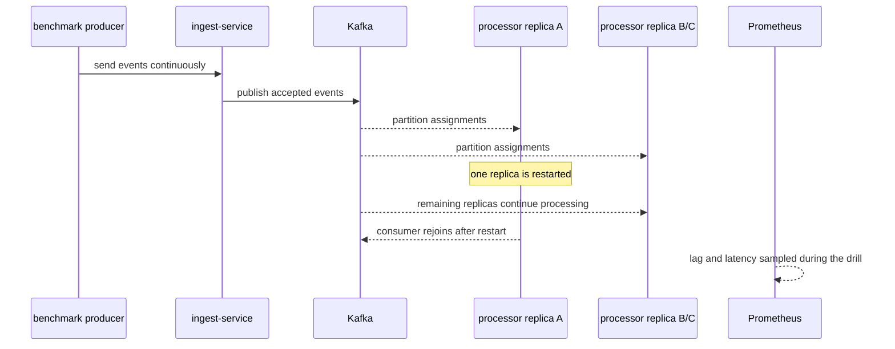

# Failure Modes

## Summary table

| Scenario | Trigger | Expected behavior | Current evidence |
| --- | --- | --- | --- |
| Processor restart during load | `./scripts/chaos/restart-processor.ps1` | ingest continues, lag rises if capacity is exceeded, processor group resumes work | verified at controlled rate in `artifacts/failure-drills/restart-processor-20260417-225121.json` |
| Duplicate injection | simulator `SIM_DUPLICATE_EVERY` or archive replay | duplicates are accepted then discarded by the processor | verified through replay drill `artifacts/failure-drills/replay-archive-20260417193652.json` |
| Malformed ingest payload burst | simulator `SIM_MALFORMED_EVERY` | ingest rejects bad payloads and records rejection rows | captured in steady-state simulator activity |
| Poison message already in Kafka | `./scripts/chaos/inject-poison-message.ps1` | processor dead-letters the bad record and commits after DLQ publish | verified in `artifacts/failure-drills/inject-poison-message-20260417-193308.json` |
| PostgreSQL pause or slowdown | `./scripts/chaos/pause-postgres.ps1` | processor write path degrades and recovers after Postgres resumes | verified in `artifacts/failure-drills/pause-postgres-20260417-224710.json` |
| Broker outage | `./scripts/chaos/broker-outage.ps1` | publish failures become visible; processor survives broker loss | verified in `artifacts/failure-drills/broker-outage-20260417-224838.json` |
| Replay and rebuild | `./scripts/chaos/replay-archive.ps1` | archived events are republished, duplicates are ignored, and scoped hot views can be rebuilt | verified in `artifacts/failure-drills/replay-archive-20260417193652.json` |
| Processor scale-out during startup | `docker compose ... --scale stream-processor=3` | replicas start without rerunning intrusive DDL or deadlocking schema setup | defect found during 2k gate; fixed with schema migration marker and retry, but needs a dedicated drill artifact |

## Evidence automation

Every benchmark or chaos drill writes a raw JSON artifact and then refreshes the normalized operator summary at `artifacts/evidence/latest.json`. The query service exposes that file through `GET /api/v1/evidence/latest`, and the dashboard renders the latest benchmark and failure-drill results from that endpoint.

Manual refresh command:

```powershell
./scripts/evidence/update-evidence.ps1
```

Schema validation:

```powershell
npm run evidence:validate
```

The purpose is not to hide raw data. The summary gives the dashboard a stable contract while keeping the raw drill artifact as the source of truth.

## Startup and scale-out defect found during QE

- Trigger: the 2k performance gate scaled `stream-processor` from `1` to `3` replicas before load.
- Observed failure before fix: new replicas exited with `ensure schema: ERROR: deadlock detected (SQLSTATE 40P01)`.
- Root cause: every service startup reran the full schema DDL block. During scale-out this could conflict with live service-state writes and startup DDL from other replicas.
- Mitigation implemented: schema initialization now records a `schema_migrations` marker and skips already-applied DDL. It also retries PostgreSQL deadlock and serialization failures during schema ensure.
- Remaining evidence gap: this was validated as part of the subsequent benchmark setup, but it should become a dedicated startup/scale-out drill artifact before claiming formal recovery coverage.

## Processor restart during load



### Single-replica evidence

- Artifact: `artifacts/failure-drills/restart-processor-20260410-192413.json`
- Result: `22,997` accepted events, `7,571` processed events, `0` new rejections
- Result: lag started high, peaked at `94,342`, and did not recover within the `30s` window

### Optimized single-replica evidence

- Artifact: `artifacts/failure-drills/restart-processor-20260410-194815.json`
- Result: `22,977` accepted events, `19,479` processed events, `0` new rejections
- Result: latency stayed at `13 ms p95` and `25 ms p99`, but backlog still did not drain inside the drill window

### Multi-replica evidence

- Artifact: `artifacts/failure-drills/restart-processor-20260417-225121.json`
- Configuration: `3` processor replicas, `300 eps` offered load, one replica restarted during active load
- Result: `12,000` accepted events, `8,238` processed events, `6,832` duplicate discards, `0` new rejections
- Result: lag recovered in `6.29s`; peak lag and final lag were both `0`
- Result: processor latency peaked at `47 ms p95` and `90 ms p99`
- Overload comparison: `artifacts/failure-drills/restart-processor-20260417-225006.json` used `800 eps`; the processor kept working but final lag remained `460`, so that run is degraded-mode evidence, not recovery success evidence

## Duplicate handling

- Mechanism: the processor writes `event_id` into `processed_events` and skips aggregate updates when the insert is not claimed
- Observable signal: `pulsestream_processor_duplicate_total`
- Captured proof: `artifacts/failure-drills/replay-archive-20260417193652.json`
- Result: replaying `25` already-processed events produced `25` duplicate discards and `0` source-metric overcount

## Malformed ingest payload handling

- Mechanism: ingest validation failures and decode failures are returned as `400` responses and written to `rejection_events`
- Observable signal: `pulsestream_ingest_rejected_total`
- Operator API: `GET /api/v1/metrics/rejections`
- Current state: the steady-state simulator can intentionally emit malformed payloads and the rejection timeline confirms that those failures are isolated from valid traffic

## Poison message already in Kafka

- Trigger: `./scripts/chaos/inject-poison-message.ps1` or write a malformed or semantically invalid record directly to Kafka
- Expected behavior: processor publishes one DLQ record, commits the source offset only after the DLQ write succeeds, and increments `dead_letter_total`
- Observed drill: `artifacts/failure-drills/inject-poison-message-20260423-153845.json`
- Observed behavior: after adding explicit startup bootstrap for the main Kafka topic and DLQ topic, the scripted drill paused the compose simulator, launched a temporary processor with a fresh consumer group at the current topic tail, wrote one malformed record directly to `pulsestream.events`, and increased `dead_letter_total` by `1`
- Observed behavior: the DLQ record captured the failure reason, source topic, source offset, consumer group, and base64-encoded original payload
- Observed behavior: consumer lag remained `0` before and after the drill, and the overview API reported `2` processor instances while the temporary verifier was running
- Interpretation: processor-side poison messages are isolated without blocking the consumer loop, and the DLQ path is no longer dependent on opportunistic topic auto-creation

## PostgreSQL pause or slowdown

- Trigger: `./scripts/chaos/pause-postgres.ps1`
- Expected behavior: processor errors become visible quickly, read paths degrade, recovery begins when Postgres resumes
- Observed drill: `artifacts/failure-drills/pause-postgres-20260423-182821.json`
- Observed behavior: with a batch-size `25`, `2,000 eps` target load and a `12s` Postgres pause, ingest accepted `140,000` events and rejected `0`
- Observed behavior: processor progress recovered inside the observation window; `processed_total_delta` was `193,538`, `peak_processor_inflight` was `4,028`, `peak_consumer_lag` reached `5,357`, and processing resumed `0.05s` after Postgres reported healthy
- Observed behavior: query-service overview calls failed visibly during the pause; the drill recorded `3` overview failures and a peak overview latency of `3036.41ms`
- Observed behavior: `publish_failed` and `backpressure` remained `0`; final consumer lag returned to `0`
- Remaining gap: the drill proves recovery, but the processed counter moved faster than accepted traffic during the pause window, so the batch-path accounting model still needs tighter explanation
- Interpretation: Postgres dependency failure is measured instead of assumed; read APIs surface the dependency failure, and the processor drains backlog again when the database returns

## Broker outage

- Trigger: `./scripts/chaos/broker-outage.ps1`
- Expected behavior: ingest publish failures become visible quickly, accepted traffic drops during the outage window, the raw archive still retains valid requests, and the processor resumes consumption after broker health returns without crashing the service
- Observed drill: `artifacts/failure-drills/broker-outage-20260423-182640.json`
- Observed behavior: with a batch-size `25`, `2,000 eps` target and a `12s` Kafka outage, the archive delta was `110,000`, accepted traffic increased by `69,800`, explicit `publish_failed` rejections increased by `1,608`, and the archive accounting gap widened to `38,592`
- Observed behavior: Kafka health was detected during the run, accepted traffic recovered `4.13s` after the broker became ready, and final lag remained `0`
- Observed behavior: `p95` / `p99` processing latency peaked at `15ms` / `38ms`, and the processor remained live for the outage drill itself
- Remaining gap: batch-path archive accounting is not yet coherent during broker disruption, so this scenario is currently degraded evidence rather than a clean resilience pass
- Interpretation: broker outage handling is partly measured, but the ingest/archive/publish counters still disagree under failure and must be reconciled before the project can claim production-grade accounting

## Replay and rebuild

- Trigger: `./scripts/chaos/replay-archive.ps1`
- Direct endpoint: `POST /api/v1/admin/replay`
- Expected behavior: archived events are republished to Kafka, duplicates are safely ignored by the processor, and hot views can be rebuilt from the raw archive after scoped state loss
- Observed drill: `artifacts/failure-drills/replay-archive-20260423153016.json`
- Observed behavior: the drill paused the compose simulator, started a temporary processor with a fresh consumer group, created a sentinel tenant with `50` accepted events, and waited until the sentinel events were processed into `processed_events` and `source_metrics`
- Observed behavior: replaying the same tenant/date archive returned `50` replayed records; the verifier processor recorded `50` duplicate discards, `processed_events` stayed at `50`, `source_metrics` stayed at `50`, and `source_metric_overcount_delta` remained `0`
- Observed behavior: after deleting only the sentinel tenant's hot-view and dedup rows, replay returned `50` records again and rebuilt both `processed_events` and `source_metrics` back to `50`
- Remaining gap: the rebuild verifier only observed `47` rebuilt events, so the scoped rebuild path is not yet fully verified even though the materialized state was restored. Indexed archive efficiency also still needs a fresh scan-ratio measurement.
- Interpretation: duplicate-safe replay is measured, and scoped hot-view rebuild appears to restore state, but the isolated verifier undercount means this scenario remains degraded until replay verification is tightened
