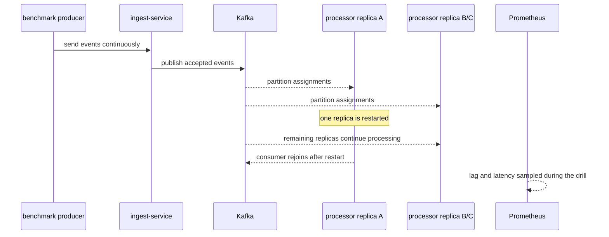

# Failure Modes

## Summary table

| Scenario | Trigger | Expected behavior | Current evidence |
| --- | --- | --- | --- |
| Processor restart during load | `./scripts/chaos/restart-processor.ps1` | ingest continues, lag rises, processor group resumes work | captured |
| Duplicate injection | simulator `SIM_DUPLICATE_EVERY` | duplicates are accepted then discarded by the processor | partially captured through benchmark artifacts |
| Malformed payload burst | simulator `SIM_MALFORMED_EVERY` | ingest rejects bad payloads and records rejection rows | captured in steady-state simulator activity |
| PostgreSQL pause or slowdown | `./scripts/chaos/pause-postgres.ps1` | processor write path degrades and recovers after Postgres resumes | script exists, fresh published artifact still needed |
| Broker outage | manual Kafka stop or restart | ingest publish failures become visible and archive retains accepted raw payloads | manual drill still needed |
| Replay and rebuild | `POST /api/v1/admin/replay` | archived events are republished and duplicates are ignored | implemented, fresh rebuild artifact still needed |

## Processor restart during load

### Single-replica evidence

- Artifact: `artifacts/failure-drills/restart-processor-20260410-192413.json`
- Result: `22,997` accepted events, `7,571` processed events, `0` new rejections
- Result: lag started high, peaked at `94,342`, and did not recover within the `30s` window

### Optimized single-replica evidence

- Artifact: `artifacts/failure-drills/restart-processor-20260410-194815.json`
- Result: `22,977` accepted events, `19,479` processed events, `0` new rejections
- Result: latency stayed at `13 ms p95` and `25 ms p99`, but backlog still did not drain inside the drill window

### Multi-replica evidence

- Artifact: `artifacts/failure-drills/restart-processor-20260410-212812.json`
- Configuration: `3` processor replicas, restart of one replica during active load
- Result: `27,406` accepted events, `31,860` processed events, `8,466` duplicates, `0` new rejections
- Result: lag started at `0`, peaked at `828`, and remained `828` at the end of the `30s` window
- Result: latency stayed at `11 ms p95` and `19 ms p99`

## Duplicate handling

- Mechanism: the processor writes `event_id` into `processed_events` and skips aggregate updates when the insert is not claimed
- Observable signal: `pulsestream_processor_duplicate_total`
- Current state: duplicate handling is implemented and exercised during benchmark runs, but there is not yet a dedicated standalone duplicate-drill artifact

## Malformed payload handling

- Mechanism: ingest validation failures and decode failures are returned as `400` responses and written to `rejection_events`
- Observable signals:
  - `pulsestream_ingest_rejected_total`
  - `GET /api/v1/metrics/rejections`
- Current state: the steady-state simulator intentionally emits malformed payloads and the rejection timeline confirms that those failures are isolated from valid traffic

## PostgreSQL slowdown or pause

- Trigger: `./scripts/chaos/pause-postgres.ps1`
- Expected behavior:
  - processor write errors become visible quickly
  - overview reads degrade because hot views stop advancing
  - recovery starts when PostgreSQL resumes
- Current gap: the script exists, but a fresh artifact should be captured and documented

## Broker outage

- Trigger: manual Kafka stop or restart
- Expected behavior:
  - publish failures become visible at ingest
  - accepted throughput drops
  - raw archive still contains accepted payloads written before publish failure
- Current gap: this scenario still needs a formal artifact

## Replay and rebuild

- Trigger: `POST /api/v1/admin/replay`
- Expected behavior:
  - archived events are republished
  - duplicates are ignored safely
  - hot views can be rebuilt without manual data edits
- Current gap: replay is implemented, but a published rebuild artifact is still needed
