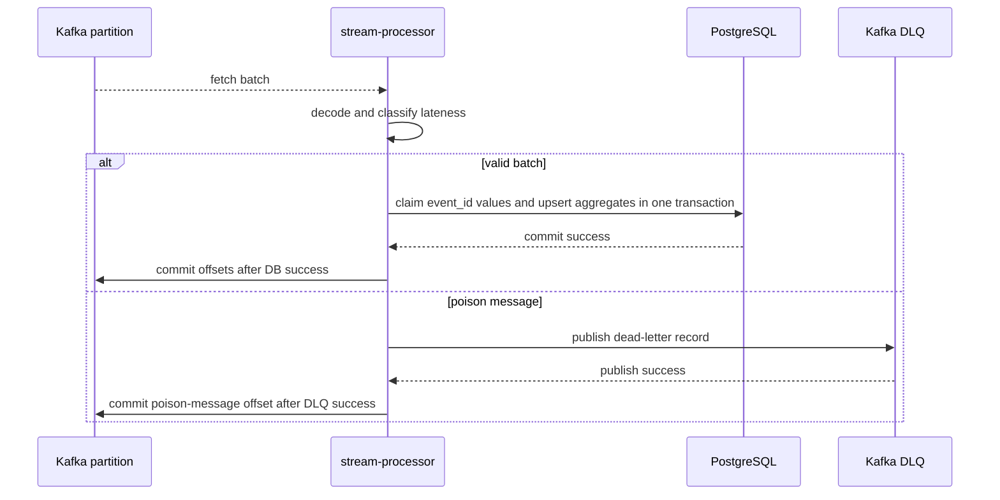

# Processing Guarantees

## Position

PulseStream is an idempotent at-least-once streaming system. It is not an exactly-once system.

Apache Flink and Kafka Streams are the reference standards for the semantics PulseStream is moving toward: event-time windows, explicit state, partition/task visibility, checkpoint or offset discipline, and late-event handling. They are not runtime dependencies in the current implementation because the project goal is to make the custom Go pipeline credible before adding another stream-processing framework.

## Delivery model



Offsets are committed only after either:

- the PostgreSQL batch transaction succeeds, or
- a poison message is successfully published to the DLQ.

If the processor crashes before either success path, Kafka can redeliver the message. Duplicate redelivery is safe because `processed_events.event_id` is the deduplication guard.

## Deduplication

`processed_events` has `event_id` as its primary key. The processor first claims event IDs inside the same PostgreSQL transaction that updates hot views. Only newly claimed events contribute to aggregates.

Duplicate events are counted in `pulsestream_processor_duplicate_total` and are visible in the overview API.

## Batch processing

Each processor owns per-partition workers. Within a partition, records are batched without reordering. The default flush policy is:

- flush every `100ms`, or
- flush when `500` records accumulate.

The processor commits Kafka offsets after the batch store transaction succeeds. This reduces PostgreSQL transaction pressure while preserving per-partition ordering.

## Event-time windows

PulseStream writes explicit event-time windows in PostgreSQL:

- `1m` fixed windows
- `5m` fixed windows
- key: `tenant_id`, `source_id`, `window_size_seconds`, `window_start`

Window assignment uses the event timestamp, not processor wall-clock time. Window boundaries are deterministic:

```text
window_start = event.timestamp.UTC().Truncate(window_size)
```

The default allowed lateness is `2 minutes`. The processor tracks the maximum event timestamp observed per partition. Events older than `max_event_time - allowed_lateness` are classified as late, claimed for deduplication, counted in `pulsestream_processor_late_event_total`, and skipped from event-window aggregates.

This is a practical watermark model, not a full Flink-style distributed watermark implementation.

## State model

PostgreSQL currently owns all processor state:

- deduplication state in `processed_events`
- legacy 10-second tenant hot buckets in `tenant_metrics`
- cumulative source counters in `source_metrics`
- event-time windows in `event_windows`
- processor/task snapshots in `service_state`

The processor does not maintain durable local state. Restart recovery relies on Kafka redelivery plus PostgreSQL idempotency.

## Replay behavior

New local archive files are written under tenant/hour prefixes:

```text
RAW_ARCHIVE_DIR/
  2026/
    04/
      10/
        tenant_01/
          13/
            events.ndjson
```

Replay prefers the indexed tenant/hour layout for scoped replays and falls back to the legacy date-only layout:

```text
RAW_ARCHIVE_DIR/2026/04/10/events.ndjson
```

Replayed records go through Kafka and the normal processor path, so duplicate replay should not overcount hot views.

## Comparison To Flink And Kafka Streams

| Capability | PulseStream now | Flink/Kafka Streams standard | Gap |
| --- | --- | --- | --- |
| Delivery guarantee | Idempotent at-least-once | At-least-once or exactly-once depending on configuration | No exactly-once transactions across Kafka and DB |
| Event time | Fixed 1m/5m event-time windows | Event-time windows with formal watermarks | No distributed watermark propagation |
| State | PostgreSQL hot state | Embedded or managed keyed state with changelogs/checkpoints | Higher DB pressure and no local state backend |
| Offset discipline | Commit after DB/DLQ success | Commit/checkpoint after processing guarantees are satisfied | No framework-managed checkpoint barrier |
| Task visibility | Partition snapshots in service state and API | Task/thread assignment and lag visibility | Coarser lag model than Kafka Streams internals |
| Replay | Archive scan and republish | Usually topic replay or savepoint/backfill patterns | Replay is custom and file/blob-prefix based |

## Known Gaps

- The local `5,000 eps` target is not met yet; the next credibility gate is `2,000 processed eps`.
- The best post-fix local `2,000 eps` gate processed `1,166.05 eps`; the latest local gate processed `910.44 eps`.
- Late-event handling is deterministic per processor partition, but it is not a full event-time watermark system.
- PostgreSQL remains the hot path; Redis or framework-managed state is intentionally deferred.
- The optional Kafka publish batcher is disabled in the Compose benchmark profile because the current local evidence did not show an improvement.
- Flink or Kafka Streams integration is deferred until the custom Go pipeline has credible local throughput evidence.
